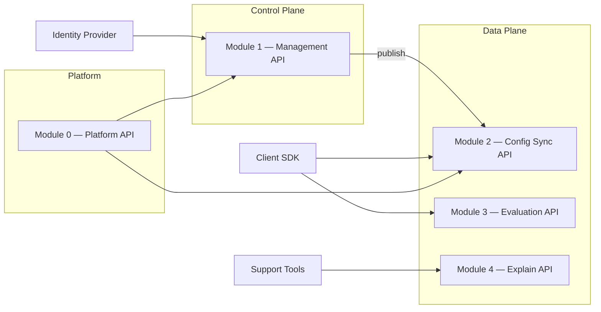

# Feature Management Service — API Design

| Attribute | Value |
|-----------|-------|
| **Document Version** | 1.0 |
| **Status** | Draft |
| **Created** | 2026-06-25 |
| **API Version** | `v1` |
| **OpenAPI** | 3.1 |
| **Related Documents** | [BRD](./Feature_Management_Service_BRD.md) · [Technical Architecture](./Feature_Management_Service_Technical_Architecture.md) · [Database Schema](./Feature_Management_Service_Database_Schema.md) · [Redis Cache Design](./Feature_Management_Service_Redis_Cache_Design.md) |

---

## 1. Purpose

This document defines the **HTTP API surface** of the Feature Management Service (FMS), organized by **functional module**. Each module maps to a deployable API boundary (or route group within a gateway) and lists endpoints, request/response schemas, authentication, and error behavior.

**Audience**: backend engineers, SDK authors, admin console developers, and integrators (CI/CD, support tooling).

---

## 2. Module Overview



| Module | Base Path | Plane | Auth | Primary Consumers |
|--------|-----------|-------|------|-------------------|
| **0 — Platform** | `/` | Shared | None / internal | Load balancers, K8s probes |
| **1 — Management** | `/v1/management` | Control | OAuth2 OIDC + RBAC | Admin console, CI/CD, engineers |
| **2 — Config Sync** | `/v1/sync` | Data | API key / mTLS | Client SDKs |
| **3 — Evaluation** | `/v1/evaluate` | Data | API key / mTLS | Server-only clients, fallback path |
| **4 — Explain** | `/v1/explain` | Data | API key + `explain:read` | Support, debugging tools |

**Base URL pattern**:

```
https://fms.{deployment-env}.example.com/api
```

Example: `https://fms.prod.example.com/api/v1/management/flags`

---

## 3. Cross-Cutting Conventions

### 3.1 Protocol

| Aspect | Rule |
|--------|------|
| **Protocol** | HTTPS only (TLS 1.2+) |
| **Format** | JSON (`Content-Type: application/json`) |
| **Charset** | UTF-8 |
| **Timestamps** | ISO-8601 UTC (`2026-06-25T10:00:00Z`) |
| **API versioning** | URL prefix `/v1`; breaking changes → `/v2` |

### 3.2 Standard Headers

| Header | Direction | Required | Description |
|--------|-----------|----------|-------------|
| `Authorization` | Request | Yes* | `Bearer <token>` (mgmt) or `ApiKey <key>` (data plane) |
| `X-Request-Id` | Request | Recommended | Client correlation ID; echoed in response |
| `traceparent` | Request | Recommended | W3C trace context |
| `Accept` | Request | Recommended | `application/json` or `text/event-stream` (SSE) |
| `Accept-Encoding` | Request | Optional | `gzip`, `br` for snapshot payloads |
| `X-Request-Id` | Response | Always | Echoed or server-generated UUID |
| `X-Config-Version` | Response | When applicable | Environment or snapshot version |
| `ETag` | Response | Sync only | Snapshot version fingerprint |
| `Cache-Control` | Response | Sync only | `private, no-cache` for versioned config |

\* Except Platform health endpoints.

### 3.3 Standard Error Response

All non-2xx responses use a consistent envelope:

```json
{
  "error": {
    "code": "FLAG_NOT_FOUND",
    "message": "The requested feature flag does not exist.",
    "requestId": "req_abc123",
    "details": [
      { "field": "flagKey", "issue": "No flag with key 'checkout_v2' in application 'checkout-service'" }
    ]
  }
}
```

| Field | Type | Description |
|-------|------|-------------|
| `code` | string | Stable machine-readable error code (see §12) |
| `message` | string | Generic human-readable message (no stack traces) |
| `requestId` | string | Correlation ID |
| `details` | array | Optional field-level validation errors |

### 3.4 Pagination

List endpoints use **cursor-based** pagination:

**Request query parameters**:

| Param | Type | Default | Description |
|-------|------|---------|-------------|
| `limit` | integer | 20 | Page size (max 100) |
| `cursor` | string | — | Opaque cursor from previous response |

**Response wrapper**:

```json
{
  "data": [ ],
  "pagination": {
    "nextCursor": "eyJpZCI6IjEyMyJ9",
    "hasMore": true,
    "totalCount": 150
  }
}
```

### 3.5 Idempotency (Management Writes)

Critical write endpoints accept:

```
Idempotency-Key: <uuid>
```

Duplicate requests with the same key within 24 hours return the original response (`200`/`202`) without re-executing the side effect.

Applicable to: `POST .../publish`, `POST .../rollback`, `POST .../kill-switch`, `POST .../promote`.

---

## 4. Module 0 — Platform API

Operational and discovery endpoints. No authentication for liveness; readiness may be internal-only.

### 4.1 Endpoints

| Method | Path | Auth | Description |
|--------|------|------|-------------|
| `GET` | `/health` | None | Liveness probe |
| `GET` | `/ready` | None / internal | Readiness (DB + Redis) |
| `GET` | `/v1/openapi.json` | None | OpenAPI 3.1 specification |

### 4.2 `GET /health`

**Response** `200 OK`:

```json
{
  "status": "UP",
  "timestamp": "2026-06-25T10:00:00Z"
}
```

### 4.3 `GET /ready`

**Response** `200 OK` when PostgreSQL and Redis are reachable:

```json
{
  "status": "READY",
  "checks": {
    "postgresql": "UP",
    "redis": "UP"
  }
}
```

**Response** `503 Service Unavailable` when a dependency is down (load balancer removes pod).

### 4.4 `GET /v1/openapi.json`

Returns the aggregated OpenAPI 3.1 document for all modules. Used by springdoc-openapi and client code generation.

---

## 5. Module 1 — Management API

**Base path**: `/v1/management`

**Authentication**: OAuth2 Bearer token (corporate OIDC).

**Authorization**: RBAC scopes (see §5.1).

All mutating operations emit an `audit_events` record.

### 5.1 RBAC Roles and Scopes

| Role | Scopes | Capabilities |
|------|--------|--------------|
| `viewer` | `flags:read`, `audit:read` | Read flags, rules, audit |
| `editor` | `flags:read`, `flags:write` | Create/update flags and rules (draft) |
| `publisher` | + `flags:publish` | Publish, rollback, promote |
| `kill_switch` | + `flags:kill` | Activate/deactivate kill switch |
| `admin` | `*` | Applications, API keys, all operations |

### 5.2 Submodule: Applications

Manage onboarded applications (`appId` scope for SDK subscription).

| Method | Path | Scope | Description |
|--------|------|-------|-------------|
| `POST` | `/applications` | `admin` | Register application |
| `GET` | `/applications` | `flags:read` | List applications |
| `GET` | `/applications/{appId}` | `flags:read` | Get application |
| `PUT` | `/applications/{appId}` | `admin` | Update application |
| `POST` | `/applications/{appId}/api-keys` | `admin` | Create API key |
| `GET` | `/applications/{appId}/api-keys` | `admin` | List API keys |
| `DELETE` | `/applications/{appId}/api-keys/{keyId}` | `admin` | Revoke API key |

#### `POST /applications`

**Request**:

```json
{
  "slug": "checkout-service",
  "name": "Checkout Service",
  "description": "Owns checkout flow flags",
  "ownerTeam": "checkout-platform"
}
```

**Response** `201 Created`:

```json
{
  "id": "550e8400-e29b-41d4-a716-446655440001",
  "slug": "checkout-service",
  "name": "Checkout Service",
  "status": "active",
  "createdAt": "2026-06-25T10:00:00Z",
  "createdBy": "user@example.com"
}
```

#### `POST /applications/{appId}/api-keys`

**Request**:

```json
{
  "name": "prod-sync-eval",
  "scopes": ["sync", "evaluate"],
  "expiresAt": "2027-06-25T00:00:00Z"
}
```

**Response** `201 Created` (plaintext key shown **once**):

```json
{
  "id": "660e8400-e29b-41d4-a716-446655440002",
  "keyPrefix": "fms_a1b2",
  "apiKey": "fms_a1b2.xxxxxxxxxxxxxxxxxxxxxxxx",
  "scopes": ["sync", "evaluate"],
  "expiresAt": "2027-06-25T00:00:00Z",
  "createdAt": "2026-06-25T10:00:00Z"
}
```

### 5.3 Submodule: Feature Flags

| Method | Path | Scope | Description |
|--------|------|-------|-------------|
| `POST` | `/flags` | `flags:write` | Create flag |
| `GET` | `/flags` | `flags:read` | List flags |
| `GET` | `/flags/{flagKey}` | `flags:read` | Get flag with rules |
| `PUT` | `/flags/{flagKey}` | `flags:write` | Update metadata |
| `DELETE` | `/flags/{flagKey}` | `flags:write` | Archive flag |
| `GET` | `/flags/{flagKey}/versions` | `flags:read` | Version history |

#### `POST /flags`

**Request**:

```json
{
  "appId": "checkout-service",
  "key": "checkout_v2",
  "name": "Checkout V2 Flow",
  "description": "New checkout experience",
  "type": "boolean",
  "defaultValue": false,
  "tags": ["checkout", "experiment"]
}
```

| Field | Type | Required | Validation |
|-------|------|----------|------------|
| `appId` | string | Yes | Must exist in `applications` |
| `key` | string | Yes | `^[a-z][a-z0-9_]{0,127}$`, unique per app |
| `type` | enum | Yes | `boolean`, `string`, `number`, `json` |
| `defaultValue` | any | Yes | Must match `type` |

**Response** `201 Created`:

```json
{
  "id": "770e8400-e29b-41d4-a716-446655440003",
  "appId": "checkout-service",
  "key": "checkout_v2",
  "name": "Checkout V2 Flow",
  "type": "boolean",
  "defaultValue": false,
  "status": "draft",
  "tags": ["checkout", "experiment"],
  "createdAt": "2026-06-25T10:00:00Z",
  "createdBy": "user@example.com"
}
```

#### `GET /flags`

**Query parameters**:

| Param | Type | Description |
|-------|------|-------------|
| `appId` | string | Filter by application |
| `tag` | string | Filter by tag |
| `status` | enum | `draft`, `published`, `archived` |
| `search` | string | Search in name/key |
| `limit`, `cursor` | | Pagination |

**Response** `200 OK`:

```json
{
  "data": [
    {
      "appId": "checkout-service",
      "key": "checkout_v2",
      "name": "Checkout V2 Flow",
      "type": "boolean",
      "status": "published",
      "updatedAt": "2026-06-25T09:00:00Z"
    }
  ],
  "pagination": { "nextCursor": null, "hasMore": false, "totalCount": 1 }
}
```

#### `GET /flags/{flagKey}`

**Query**: `appId` (required)

**Response** `200 OK`:

```json
{
  "appId": "checkout-service",
  "key": "checkout_v2",
  "name": "Checkout V2 Flow",
  "description": "New checkout experience",
  "type": "boolean",
  "defaultValue": false,
  "status": "published",
  "tags": ["checkout"],
  "environmentStates": [
    {
      "environment": "staging",
      "isPublished": true,
      "latestConfigVersion": 1040,
      "draftDirty": false
    },
    {
      "environment": "prod",
      "isPublished": true,
      "latestConfigVersion": 1043,
      "draftDirty": true
    }
  ],
  "rules": {
    "prod": [
      {
        "id": "550e8400-e29b-41d4-a716-446655440000",
        "priority": 10,
        "name": "NA 5% rollout",
        "conditions": {
          "region": { "operator": "in", "values": ["US", "CA"] },
          "rolloutPercent": 5
        },
        "value": true,
        "isEnabled": true
      }
    ]
  },
  "createdAt": "2026-06-01T00:00:00Z",
  "updatedAt": "2026-06-25T09:00:00Z"
}
```

### 5.4 Submodule: Rules

| Method | Path | Scope | Description |
|--------|------|-------|-------------|
| `PUT` | `/flags/{flagKey}/rules` | `flags:write` | Replace all rules for an environment |
| `PATCH` | `/flags/{flagKey}/rules/{ruleId}` | `flags:write` | Update single rule |

#### `PUT /flags/{flagKey}/rules`

**Query**: `appId` (required)

**Request**:

```json
{
  "environment": "prod",
  "rules": [
    {
      "priority": 10,
      "name": "NA 5% rollout",
      "conditions": {
        "region": { "operator": "in", "values": ["US", "CA"] },
        "rolloutPercent": 5
      },
      "value": true,
      "isEnabled": true
    },
    {
      "priority": 20,
      "name": "EU full rollout",
      "conditions": {
        "region": { "operator": "in", "values": ["DE", "FR", "UK"] }
      },
      "value": true,
      "isEnabled": true
    }
  ]
}
```

**Response** `200 OK`: Updated flag with rules (same shape as `GET /flags/{flagKey}`).

**Validation**:

- Unique `priority` per `(flagKey, environment)`
- `rolloutPercent` in range 0–100
- Max 50 rules per flag per environment
- `conditions` operators from allowed set (see §11)

### 5.5 Submodule: Publish & Lifecycle

| Method | Path | Scope | Description |
|--------|------|-------|-------------|
| `POST` | `/flags/{flagKey}/publish` | `flags:publish` | Publish to environment |
| `POST` | `/flags/{flagKey}/rollback` | `flags:publish` | Rollback to prior version |
| `GET` | `/flags/{flagKey}/versions/{version}` | `flags:read` | Get specific published snapshot |

#### `POST /flags/{flagKey}/publish`

**Query**: `appId` (required)

**Request**:

```json
{
  "environment": "prod",
  "releaseId": "REL-2026-06-25-checkout",
  "comment": "Enable checkout_v2 at 5% NA",
  "killSwitch": false
}
```

**Response** `202 Accepted` (async publish via Outbox):

```json
{
  "flagKey": "checkout_v2",
  "appId": "checkout-service",
  "environment": "prod",
  "configVersion": 1043,
  "flagVersion": 7,
  "publishJobId": "88001",
  "status": "pending",
  "publishedAt": "2026-06-25T10:00:00Z",
  "publishedBy": "user@example.com"
}
```

**Response headers**: `X-Config-Version: 1043`

#### `POST /flags/{flagKey}/rollback`

**Request**:

```json
{
  "appId": "checkout-service",
  "environment": "prod",
  "targetFlagVersion": 6,
  "comment": "Rollback due to incident INC-1234"
}
```

**Response** `202 Accepted`: Same shape as publish response with incremented `configVersion`.

### 5.6 Submodule: Environments & Promotion

| Method | Path | Scope | Description |
|--------|------|-------|-------------|
| `GET` | `/environments` | `flags:read` | List environments |
| `GET` | `/environments/{env}/config` | `flags:read` | Current environment config version |
| `POST` | `/environments/{env}/promote` | `flags:publish` | Promote from source environment |

#### `POST /environments/{env}/promote`

Promotes published configuration from a lower environment (e.g., staging → prod).

**Request**:

```json
{
  "sourceEnvironment": "staging",
  "flagKeys": ["checkout_v2", "payment_wallet"],
  "appId": "checkout-service",
  "releaseId": "REL-2026-06-25-checkout",
  "comment": "Promote validated staging config"
}
```

**Response** `202 Accepted`:

```json
{
  "targetEnvironment": "prod",
  "sourceEnvironment": "staging",
  "promotedFlags": ["checkout_v2", "payment_wallet"],
  "configVersion": 1044,
  "publishJobIds": ["88002", "88003"]
}
```

### 5.7 Submodule: Releases

| Method | Path | Scope | Description |
|--------|------|-------|-------------|
| `POST` | `/releases` | `flags:write` | Create release record |
| `GET` | `/releases` | `flags:read` | List releases |
| `GET` | `/releases/{releaseId}` | `flags:read` | Get release with linked flags |
| `POST` | `/releases/{releaseId}/flags` | `flags:write` | Link flags to release |

#### `POST /releases`

**Request**:

```json
{
  "releaseId": "REL-2026-06-25-checkout",
  "version": "3.2.0",
  "title": "Checkout 3.2 Release",
  "description": "Includes checkout_v2 flag rollout",
  "metadata": {
    "ciPipelineId": "pipe_abc",
    "commitSha": "a1b2c3d4"
  }
}
```

**Response** `201 Created`:

```json
{
  "id": "990e8400-e29b-41d4-a716-446655440004",
  "releaseId": "REL-2026-06-25-checkout",
  "version": "3.2.0",
  "title": "Checkout 3.2 Release",
  "createdAt": "2026-06-25T08:00:00Z",
  "createdBy": "ci-bot@example.com"
}
```

### 5.8 Submodule: Kill Switch

Fast-path emergency disable. Requires `flags:kill` scope.

| Method | Path | Scope | Description |
|--------|------|-------|-------------|
| `POST` | `/flags/{flagKey}/kill-switch` | `flags:kill` | Activate kill switch |
| `DELETE` | `/flags/{flagKey}/kill-switch` | `flags:kill` | Deactivate kill switch |
| `GET` | `/flags/{flagKey}/kill-switch` | `flags:read` | Get active overrides |

#### `POST /flags/{flagKey}/kill-switch`

**Request**:

```json
{
  "appId": "checkout-service",
  "environment": "prod",
  "scope": "region",
  "regionCode": "US",
  "forcedValue": false,
  "comment": "INC-1234 checkout errors in US"
}
```

**Response** `200 OK`:

```json
{
  "flagKey": "checkout_v2",
  "environment": "prod",
  "scope": "region",
  "regionCode": "US",
  "isActive": true,
  "forcedValue": false,
  "activatedAt": "2026-06-25T11:00:00Z",
  "activatedBy": "sre@example.com",
  "configVersion": 1045
}
```

### 5.9 Submodule: Audit

| Method | Path | Scope | Description |
|--------|------|-------|-------------|
| `GET` | `/audit` | `audit:read` | Query audit events |

**Query parameters**:

| Param | Type | Description |
|-------|------|-------------|
| `resourceType` | string | e.g., `feature_flag` |
| `resourceId` | string | Flag key or resource ID |
| `actor` | string | Filter by actor |
| `action` | enum | `publish`, `rollback`, `kill_switch_on`, etc. |
| `environment` | string | Environment filter |
| `from`, `to` | datetime | Time range |
| `limit`, `cursor` | | Pagination |

**Response** `200 OK`:

```json
{
  "data": [
    {
      "id": "100001",
      "actor": "user@example.com",
      "action": "publish",
      "resourceType": "feature_flag",
      "resourceId": "checkout_v2",
      "environment": "prod",
      "diff": {
        "before": { "configVersion": 1042 },
        "after": { "configVersion": 1043 },
        "changedFields": ["rules", "configVersion"]
      },
      "createdAt": "2026-06-25T10:00:00Z"
    }
  ],
  "pagination": { "nextCursor": null, "hasMore": false }
}
```

---

## 6. Module 2 — Config Sync API

**Base path**: `/v1/sync`

**Authentication**: `Authorization: ApiKey <key>` or mTLS service identity.

**Purpose**: Deliver full/incremental configuration snapshots to SDKs; broadcast version changes via SSE.

### 6.1 Endpoints

| Method | Path | Description |
|--------|------|-------------|
| `GET` | `/snapshot` | Full or incremental snapshot |
| `HEAD` | `/version` | Lightweight version check |
| `GET` | `/stream` | SSE version update stream |

### 6.2 `GET /snapshot`

**Query parameters**:

| Param | Type | Required | Description |
|-------|------|----------|-------------|
| `environment` | string | Yes | `dev`, `staging`, `prod` |
| `appId` | string | Yes | Application subscription scope |
| `sinceVersion` | integer | No | If set, return delta from this version |

**Response** `200 OK` — full snapshot:

```json
{
  "environment": "prod",
  "appId": "checkout-service",
  "configVersion": 1043,
  "syncType": "full",
  "generatedAt": "2026-06-25T10:00:05Z",
  "flags": [
    {
      "key": "checkout_v2",
      "type": "boolean",
      "defaultValue": false,
      "status": "published",
      "rolloutSalt": "a1b2c3d4e5f6",
      "rules": [
        {
          "id": "550e8400-e29b-41d4-a716-446655440000",
          "priority": 10,
          "conditions": {
            "region": { "operator": "in", "values": ["US", "CA"] },
            "rolloutPercent": 5
          },
          "value": true
        }
      ],
      "releaseId": "REL-2026-06-25-checkout"
    }
  ],
  "deletedFlagKeys": []
}
```

**Response** `200 OK` — delta (`sinceVersion` within retention window):

```json
{
  "environment": "prod",
  "appId": "checkout-service",
  "configVersion": 1043,
  "previousVersion": 1042,
  "syncType": "delta",
  "flags": [ ],
  "deletedFlagKeys": []
}
```

**Response** `304 Not Modified**: When `If-None-Match` ETag matches current version.

**Response** `400 Bad Request` (`DELTA_VERSION_GAP_TOO_LARGE`): Client must request full snapshot.

**Performance**: P95 < 50ms from Redis cache hit; `Content-Encoding: gzip` supported.

### 6.3 `HEAD /version`

Lightweight poll for environment-wide version (no snapshot body).

**Query**: `environment` (required), `appId` (optional — if set, returns app-specific version)

**Response** `200 OK`:

```
X-Config-Version: 1043
ETag: "prod:checkout-service:1043"
```

No response body.

### 6.4 `GET /stream`

Server-Sent Events stream for version updates. **Sole streaming protocol** for config push.

**Query**: `environment` (required), `appId` (required)

**Response** `200 OK`, `Content-Type: text/event-stream`:

```
event: version
data: {"configVersion":1043,"previousVersion":1042,"environment":"prod","appId":"checkout-service"}

event: heartbeat
data: {"timestamp":"2026-06-25T10:01:00Z"}

event: version
data: {"configVersion":1044,"previousVersion":1043,"environment":"prod","appId":"checkout-service"}
```

| Event | Description |
|-------|-------------|
| `version` | New `configVersion` available; client should call `GET /snapshot?sinceVersion=...` |
| `heartbeat` | Keep-alive every 30s |

**Client behavior**: On `version` event, fetch delta. On disconnect, exponential backoff reconnect and compare `HEAD /version`.

---

## 7. Module 3 — Evaluation API

**Base path**: `/v1/evaluate`

**Authentication**: API key with `evaluate` scope or mTLS.

**Purpose**: Stateless remote evaluation for server-only integrations or SDK fallback. Not the primary hot path — SDK local evaluation is preferred.

### 7.1 Endpoints

| Method | Path | Description |
|--------|------|-------------|
| `POST` | `/flags/{flagKey}` | Evaluate single flag |
| `POST` | `/batch` | Evaluate multiple flags |

### 7.2 Shared Request Fields

```json
{
  "environment": "prod",
  "appId": "checkout-service",
  "configVersion": 1043,
  "context": {
    "userId": "usr_123",
    "deviceId": null,
    "region": "US",
    "appVersion": "3.2.1",
    "customAttributes": {
      "loyaltyTier": "gold"
    }
  }
}
```

| Field | Type | Required | Description |
|-------|------|----------|-------------|
| `environment` | string | Yes | Target environment |
| `appId` | string | Yes | Application scope |
| `configVersion` | integer | No | Pin evaluation to specific version; default = latest |
| `context` | object | Yes | Evaluation context (see §11.2) |

### 7.3 `POST /flags/{flagKey}`

**Response** `200 OK`:

```json
{
  "flagKey": "checkout_v2",
  "value": true,
  "enabled": true,
  "type": "boolean",
  "configVersion": 1043,
  "evaluationMode": "remote",
  "reasonCode": "RULE_MATCH",
  "latencyMs": 4
}
```

| Field | Description |
|-------|-------------|
| `enabled` | `true` when boolean value is truthy; for non-boolean, indicates active match |
| `evaluationMode` | `remote` (always for this API) |
| `reasonCode` | Summary code (no full trace — use Explain API) |

### 7.4 `POST /batch`

**Request**:

```json
{
  "environment": "prod",
  "appId": "checkout-service",
  "flagKeys": ["checkout_v2", "payment_wallet", "new_search_ui"],
  "context": {
    "userId": "usr_123",
    "region": "US",
    "appVersion": "3.2.1"
  }
}
```

**Limits**: Max **50** flag keys per request.

**Response** `200 OK`:

```json
{
  "configVersion": 1043,
  "evaluationMode": "remote",
  "results": [
    {
      "flagKey": "checkout_v2",
      "value": true,
      "enabled": true,
      "reasonCode": "RULE_MATCH"
    },
    {
      "flagKey": "payment_wallet",
      "value": false,
      "enabled": false,
      "reasonCode": "DEFAULT_VALUE"
    },
    {
      "flagKey": "new_search_ui",
      "value": false,
      "enabled": false,
      "reasonCode": "NOT_PUBLISHED"
    }
  ],
  "latencyMs": 8
}
```

**Performance target**: P99 ≤ 20ms at cache hit.

---

## 8. Module 4 — Explain API

**Base path**: `/v1/explain`

**Authentication**: API key with `explain:read` scope (elevated; support tooling).

**Purpose**: Structured decision traces for support and debugging. Not on the hot evaluation path.

### 8.1 Endpoints

| Method | Path | Description |
|--------|------|-------------|
| `POST` | `/flags/{flagKey}` | Explain current evaluation |
| `POST` | `/flags/{flagKey}/replay` | Point-in-time replay |

### 8.2 `POST /flags/{flagKey}`

**Request**:

```json
{
  "environment": "prod",
  "appId": "checkout-service",
  "context": {
    "userId": "usr_123",
    "region": "US",
    "appVersion": "3.2.1"
  },
  "includeCustomAttributes": false
}
```

**Response** `200 OK`:

```json
{
  "flagKey": "checkout_v2",
  "enabled": true,
  "value": true,
  "type": "boolean",
  "configVersion": 1043,
  "release": {
    "releaseId": "REL-2026-06-25-checkout",
    "version": "3.2.0"
  },
  "context": {
    "userId": "usr_***",
    "region": "US"
  },
  "bucket": 234,
  "decisionTrace": [
    {
      "step": "environment_check",
      "result": "pass",
      "detail": "published in prod"
    },
    {
      "step": "kill_switch_check",
      "result": "pass",
      "detail": "no active kill switch"
    },
    {
      "step": "rule_evaluation",
      "ruleId": "550e8400-e29b-41d4-a716-446655440000",
      "ruleName": "NA 5% rollout",
      "result": "match",
      "detail": "region US in [US, CA]; bucket 234 < 500 (5%)"
    }
  ],
  "matchedRuleId": "550e8400-e29b-41d4-a716-446655440000",
  "reasonCode": "RULE_MATCH",
  "schemaVersion": "1.0"
}
```

**Privacy**: `userId` masked by default; `includeCustomAttributes: true` requires `explain:pii` scope.

### 8.3 `POST /flags/{flagKey}/replay`

Replay evaluation against a historical configuration.

**Request** (by version):

```json
{
  "environment": "prod",
  "appId": "checkout-service",
  "configVersion": 1040,
  "context": {
    "userId": "usr_123",
    "region": "US"
  }
}
```

**Request** (by timestamp):

```json
{
  "environment": "prod",
  "appId": "checkout-service",
  "timestamp": "2026-06-24T15:30:00Z",
  "context": {
    "userId": "usr_123",
    "region": "US"
  }
}
```

**Response**: Same shape as §8.2 with `"evaluationMode": "replay"`.

### 8.4 Reason Codes (Stable Enum)

| Code | Meaning |
|------|---------|
| `RULE_MATCH` | A rule matched; `value` from matched rule |
| `DEFAULT_VALUE` | No rule matched; flag default returned |
| `KILL_SWITCH` | Kill switch forced the value |
| `NOT_PUBLISHED` | Flag not published in environment |
| `ARCHIVED` | Flag archived; excluded from evaluation |
| `NO_MATCH` | Rules evaluated; none matched |
| `INCOMPLETE_CONTEXT` | Missing `userId`/`deviceId` for bucketing |

---

## 9. Shared Data Models

### 9.1 Rule Condition Schema

```json
{
  "region": { "operator": "in", "values": ["US", "CA"] },
  "appVersion": { "operator": "semver_gte", "value": "3.2.0" },
  "userId": { "operator": "in", "values": ["usr_1"] },
  "segment": { "operator": "in_segment", "segmentId": "seg_gold_users" },
  "rolloutPercent": 5,
  "customAttributes": {
    "loyaltyTier": { "operator": "eq", "value": "gold" }
  }
}
```

**Allowed operators**: `eq`, `neq`, `in`, `not_in`, `semver_gte`, `semver_lte`, `in_segment`.

### 9.2 Evaluation Context Schema

| Field | Type | Required | Description |
|-------|------|----------|-------------|
| `userId` | string | Recommended | Stable user identifier |
| `deviceId` | string | Fallback | Anonymous bucketing when no `userId` |
| `region` | string | Recommended | ISO 3166-1 alpha-2 |
| `appVersion` | string | Optional | Semver string |
| `customAttributes` | object | Optional | Key-value segment attributes |

**Bucketing precedence**: `userId` → `deviceId` → default with `INCOMPLETE_CONTEXT`.

### 9.3 Flag Types and Values

| `type` | `defaultValue` / `value` example |
|--------|-----------------------------------|
| `boolean` | `true`, `false` |
| `string` | `"control"`, `"variant_a"` |
| `number` | `42`, `3.14` |
| `json` | `{ "theme": "dark" }` |

### 9.4 Flag Status

| Status | Evaluation behavior |
|--------|---------------------|
| `draft` | Not evaluated in published environments |
| `published` | Active |
| `archived` | Excluded from evaluation; may appear in `deletedFlagKeys` on sync |

---

## 10. HTTP Status Code Summary

| Code | Usage |
|------|-------|
| `200` | Successful read or synchronous write |
| `201` | Resource created |
| `202` | Accepted — async publish job queued |
| `204` | Successful delete (kill switch off) |
| `304` | Snapshot not modified (ETag match) |
| `400` | Validation error, invalid conditions |
| `401` | Missing or invalid authentication |
| `403` | Insufficient scope / RBAC denial |
| `404` | Flag, app, or release not found |
| `409` | Conflict (duplicate key, publish in progress) |
| `422` | Semantic error (e.g., rollback target not found) |
| `429` | Rate limit exceeded |
| `500` | Internal error (generic message only) |
| `503` | Dependency unavailable / not ready |

---

## 11. Rate Limits

| Module | Limit | Key |
|--------|-------|-----|
| Config Sync `GET /snapshot` | 60 req/min per `appId` | API key |
| Config Sync `GET /stream` | 5 concurrent connections per `appId` | API key |
| Evaluation `POST /flags/*` | 10,000 req/min per `appId` | API key |
| Evaluation `POST /batch` | 5,000 req/min per `appId` | API key |
| Explain | 100 req/min per API key | API key |
| Management | 300 req/min per user | OIDC subject |

**Response** `429 Too Many Requests`:

```json
{
  "error": {
    "code": "RATE_LIMIT_EXCEEDED",
    "message": "Rate limit exceeded. Retry after 30 seconds.",
    "requestId": "req_xyz",
    "details": [{ "retryAfterSeconds": 30 }]
  }
}
```

Headers: `Retry-After: 30`, `X-RateLimit-Remaining: 0`

---

## 12. Error Code Catalog

| Code | HTTP | Module | Description |
|------|------|--------|-------------|
| `VALIDATION_ERROR` | 400 | All | Request body or query failed validation |
| `INVALID_FLAG_KEY` | 400 | Management | Flag key format invalid |
| `INVALID_CONDITIONS` | 400 | Management | Rule conditions schema/operator invalid |
| `DELTA_VERSION_GAP_TOO_LARGE` | 400 | Sync | `sinceVersion` outside retention; full sync required |
| `UNAUTHORIZED` | 401 | All | Missing or invalid credentials |
| `FORBIDDEN` | 403 | All | Insufficient scope |
| `FLAG_NOT_FOUND` | 404 | All | Flag does not exist for `appId` |
| `APPLICATION_NOT_FOUND` | 404 | Management | Unknown `appId` |
| `RELEASE_NOT_FOUND` | 404 | Management | Unknown `releaseId` |
| `VERSION_NOT_FOUND` | 404 | Management, Explain | Config version does not exist |
| `FLAG_ALREADY_EXISTS` | 409 | Management | Duplicate `(appId, key)` |
| `PUBLISH_IN_PROGRESS` | 409 | Management | Publish job pending for flag |
| `ROLLBACK_TARGET_NOT_FOUND` | 422 | Management | `targetFlagVersion` does not exist |
| `RATE_LIMIT_EXCEEDED` | 429 | Data plane | Throttled |
| `INTERNAL_ERROR` | 500 | All | Unexpected server error |
| `SERVICE_UNAVAILABLE` | 503 | All | Dependency down |

---

## 13. Requirement Traceability

| BRD ID | API Module | Endpoint(s) |
|--------|------------|---------------|
| FR-20 | Management | Flags/rules CRUD |
| FR-21 | Management | `GET /flags` with filters |
| FR-22 | Management | publish, rollback, promote |
| FR-23 | Management | OIDC + RBAC + audit |
| FR-24 | Platform | `GET /v1/openapi.json` |
| FR-30 | Evaluation | `POST /evaluate/flags/{flagKey}` |
| FR-31 | Evaluation | `POST /evaluate/batch` |
| FR-32 | Config Sync | `GET /sync/snapshot` |
| FR-33 | Evaluation, Sync | API key auth |
| FR-40–FR-43 | Explain | `POST /explain/flags/*` |
| FR-62 | Config Sync | `GET /sync/stream` (SSE) |

---

## 14. Implementation Notes

### 14.1 Service Deployment

Modules may be deployed as:

| Option | Description |
|--------|-------------|
| **Monolith (MVP)** | Single Spring Boot app with route prefixes |
| **Split services** | Separate deployments per module; shared gateway |

Gateway routes:

```
/api/v1/management/*  → management-service
/api/v1/sync/*        → sync-service
/api/v1/evaluate/*    → eval-service
/api/v1/explain/*     → explain-service
```

### 14.2 OpenAPI Generation

- springdoc-openapi 3.0.3 per [Technology Stack](./Feature_Management_Service_Technology_Stack.md)
- One aggregated spec at `/v1/openapi.json`; optional per-module specs at `/v1/management/openapi.json`, etc.
- Client SDKs generated from OpenAPI for admin console (Vaadin REST client)

### 14.3 Future Modules (Out of Scope v1)

| Module | Path | Notes |
|--------|------|-------|
| Webhooks | `/v1/webhooks` | Publish notifications to external systems |
| Segments | `/v1/segments` | External segment service proxy |
| Analytics | `/v1/analytics` | Evaluation volume aggregates |

---

## 15. References

- [Feature Management Service BRD](./Feature_Management_Service_BRD.md) — §7 Functional Requirements
- [Feature Management Service Technical Architecture](./Feature_Management_Service_Technical_Architecture.md) — §8 API Design, §10 Explainability
- [Feature Management Service Database Schema](./Feature_Management_Service_Database_Schema.md) — Entity model
- [Feature Management Service Redis Cache Design](./Feature_Management_Service_Redis_Cache_Design.md) — Sync cache paths
- [OpenAPI 3.1 Specification](https://spec.openapis.org/oas/v3.1.0)

---

*This document evolves with implementation. Endpoint or schema changes must update `/v1/openapi.json` and this document's version number.*
