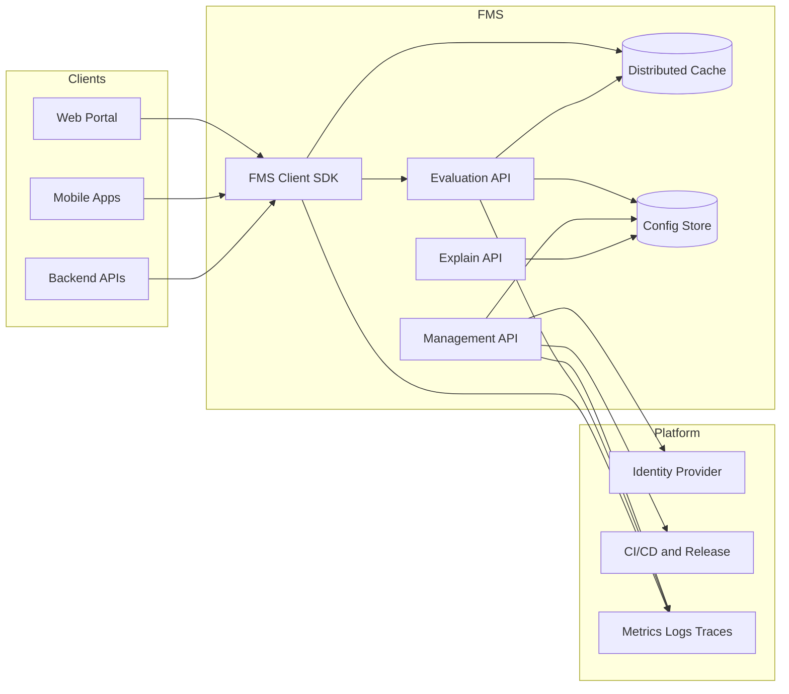

# Feature Management Service — Business Requirements Document (BRD)

| Attribute | Value |
|-----------|-------|
| **Document Version** | 1.0 |
| **Status** | Draft |
| **Created** | 2026-06-25 |
| **Source** | Align Expert Software Engineer R2 Quiz |
| **Product Name** | Feature Management Service (FMS) |

---

## 1. Executive Summary

As the e-commerce platform iterates rapidly, it must centrally manage **thousands of feature flags** across **100+ applications and services**—including web portals, backend APIs, and mobile clients. Today there is no centralized, observable, and explainable feature-management capability. That gap drives elevated release risk, makes gradual rollouts hard to execute, and causes inconsistent behavior across client surfaces.

This BRD defines the business objectives, scope, functional requirements, and non-functional requirements for the **Feature Management Service (FMS)**. FMS will serve as platform-level infrastructure, providing full lifecycle management of feature flags, high-throughput low-latency online evaluation, a consistent SDK integration experience across client types, and observability and explainability capabilities to support safe releases, A/B experiments, and progressive delivery.

---

## 2. Business Background and Problem Statement

### 2.1 Business Background

- The e-commerce platform has many business lines and high release velocity. Feature flags are now the standard mechanism for controlling feature visibility, traffic splitting, and emergency rollback.
- Feature flags are scattered across application configs, environment variables, and bespoke solutions, with no unified governance.
- The evaluation path must handle heavy load during peak traffic, and resource cost must not grow linearly as the feature catalog expands.

### 2.2 Current Pain Points

| Pain Point | Impact |
|------------|--------|
| Fragmented flag definitions and version drift | Inconsistent behavior across web, API, and mobile; difficult troubleshooting |
| No unified gradual rollout and targeting rules | Cannot precisely roll out by user, region, or app version |
| High evaluation latency or coarse cache invalidation | Degrades core paths such as checkout and search |
| Cannot answer “why is this enabled for this user?” | Long time to resolve customer complaints and production issues |
| Lack of systematic monitoring | Misconfigured flags and evaluation anomalies are detected late |

### 2.3 Business Opportunity

A unified FMS can materially reduce release risk, shorten incident recovery time (via one-click feature disable), and provide a consistent foundation for product experimentation and regional operations.

---

## 3. Business Objectives

### 3.1 Primary Objectives

1. **Centralized governance**: A single platform to manage company-wide flag definitions, rules, and release associations.
2. **Safe releases**: Support progressive rollout, targeted exposure, and emergency kill switches.
3. **High-performance evaluation**: Evaluate flags at low latency and high throughput during e-commerce peak traffic.
4. **Cross-surface consistency**: Web, backend APIs, and mobile clients obtain consistent evaluation results through unified semantics and SDKs.
5. **Observability and explainability**: Operations and engineering can monitor health and produce clear attribution for any evaluation result.

### 3.2 Key Performance Indicators (KPIs)

| KPI | Target (Initial Release) | Notes |
|-----|--------------------------|-------|
| Evaluation P99 latency | ≤ 5 ms (SDK local hit) / ≤ 20 ms (remote origin) | Core transaction paths |
| Evaluation availability | ≥ 99.95% | Monthly |
| Config propagation time | ≤ 60 s (P95) | From management publish to visibility on all nodes |
| Connected applications | 100+ | Within 12 months |
| Managed features | 5,000+ | Scalable to tens of thousands |
| P1 incidents from misconfiguration | 0 (reduced via audit and change process) | Annual |
| Evaluation attribution query success rate | ≥ 99% | Explain API available scenarios |

---

## 4. Scope

### 4.1 In Scope

- Create, edit, publish, archive, and version feature flags
- Evaluation rules: boolean flags, percentage rollout, user/segment targeting, region, environment, version/app dimensions
- Management API, evaluation API, Explain (explainability) API, and supporting APIs as needed
- Multi-language / multi-runtime client SDKs (at minimum: server-side, web, and mobile abstractions)
- Distributed caching and invalidation strategy
- Observability: metrics, logs, distributed tracing, alerting
- Authorization, audit, and change traceability (management plane)
- Association with release pipelines and versions (release dimension)

### 4.2 Out of Scope — Initial Release

- Full A/B experiment analytics platform (may integrate with external experiment platforms; FMS provides traffic splitting only)
- Non-feature dynamic configuration (e.g., full replacement of a business parameter center)
- Multi-tenant SaaS commercialization for external customers
- Front-end implementation details of the admin console UI (this BRD defines capability requirements only, not technology stack)

---

## 5. Stakeholders

| Role | Needs |
|------|-------|
| **Product Manager** | Control feature rollout by region and user segment; tie flags to release plans |
| **Software Engineer** | Simple SDK integration, good local dev experience, clear APIs |
| **SRE / Operations** | Health monitoring, predictable capacity, fast incident diagnosis |
| **Release Manager** | Gradual rollout strategies, rollback, release binding |
| **Customer Support** | Explainable results to answer why a user sees or does not see a feature |
| **Security & Compliance** | Least-privilege access, audit logs, protection of sensitive rules |

---

## 6. User Stories

### US-01: Emergency disable of a problematic feature

> As an **SRE**, when a new feature causes a production incident, I need to disable that flag globally or by region within **30 seconds**, with changes propagating quickly to all clients **without redeploying applications**.

**Acceptance criteria**: Kill switch actions are audited; evaluation results flip within the agreed propagation window.

### US-02: Progressive regional rollout

> As a **Product Manager**, I want to expose the “new checkout flow” to only **5% of users in North America** first, then expand to 50% and 100% after validation.

**Acceptance criteria**: Region + percentage rules are supported; Explain API describes why a rule matched.

### US-03: Consistent cross-surface experience

> As **mobile and web engineers**, when we use the same `checkout_v2` flag, we expect the same user to receive **consistent** evaluation results on app and web (given the same context).

**Acceptance criteria**: SDK rule semantics are aligned; documentation clearly specifies required context fields (e.g., `userId`, `region`).

### US-04: Investigate “why enabled for this user”

> As a **Support Engineer**, when a user reports they cannot see a promotion entry, I can supply `userId`, `flagKey`, and a timestamp and receive: **whether it is enabled, which rule matched, which release it is tied to, and the evaluation context**.

**Acceptance criteria**: Explain API returns structured attribution without exposing sensitive internal implementation details.

### US-05: Peak traffic with controlled caching cost

> As a **Platform Architect**, during major sales events, evaluation QPS spikes but **cache and origin load** must not grow linearly with the number of features.

**Acceptance criteria**: Caching strategy documents hit rate, memory bounds, and invalidation mechanics; load tests meet KPIs.

---

## 7. Functional Requirements

### 7.1 Feature Lifecycle Management

| ID | Requirement | Priority |
|----|-------------|----------|
| FR-01 | Create feature flags with unique `key`, name, description, type (boolean / multivariate, etc.), and owning application/domain | P0 |
| FR-02 | Support per-environment configuration (dev/staging/prod) and promotion workflows | P0 |
| FR-03 | Support configuration version history, diff, and rollback | P0 |
| FR-04 | Support flag states: draft, published, archived; archived flags do not participate in evaluation by default | P1 |
| FR-05 | Associate flags with a **Release** (version number, release ticket ID, publish time) | P0 |

### 7.2 Evaluation Rule Engine

| ID | Requirement | Priority |
|----|-------------|----------|
| FR-10 | Support global on/off default values | P0 |
| FR-11 | Support stable **percentage** bucketing (same `userId` always gets the same result) | P0 |
| FR-12 | Support targeting by **user ID, user attributes, and custom segments** | P0 |
| FR-13 | Support targeting by **geographic region** (country/region), **environment**, and **application ID** | P0 |
| FR-14 | Support rule priority and short-circuit evaluation order | P1 |
| FR-15 | Support scheduled activation windows (timed on/off) | P2 |

### 7.3 Management API

| ID | Requirement | Priority |
|----|-------------|----------|
| FR-20 | REST or equivalent API: CRUD for flags, rules, and environment configuration | P0 |
| FR-21 | Batch query, pagination, filtering by application/tag | P0 |
| FR-22 | Publish, rollback, and environment promotion APIs | P0 |
| FR-23 | Management API requires authentication and authorization (RBAC); critical writes emit audit logs | P0 |
| FR-24 | Publish OpenAPI specification for SDK and console client generation | P1 |

### 7.4 Evaluation API

| ID | Requirement | Priority |
|----|-------------|----------|
| FR-30 | Single-flag evaluation: `evaluate(flagKey, context) → value + metadata` | P0 |
| FR-31 | Batch evaluation: evaluate multiple `flagKey` values in one request to reduce round trips | P0 |
| FR-32 | Support full and incremental configuration snapshots for SDK local evaluation | P0 |
| FR-33 | Stateless, horizontally scalable evaluation API; API key or service identity authentication | P0 |
| FR-34 | Degradation strategy: when remote is unavailable, SDK uses last successful snapshot and exposes degradation metrics | P0 |

### 7.5 Explain API

| ID | Requirement | Priority |
|----|-------------|----------|
| FR-40 | For a single evaluation, return: **final value, enabled state, matched rule chain, and reasons for non-match** | P0 |
| FR-41 | Return attribution fields: **region, user targeting, percentage bucket, associated release** | P0 |
| FR-42 | Support point-in-time evaluation replay (based on the published configuration version at that time) | P1 |
| FR-43 | Explain output is stable and versioned for both human consumption and system integration | P1 |

### 7.6 Client SDK

| ID | Requirement | Priority |
|----|-------------|----------|
| FR-50 | Provide **server-side** SDKs (e.g., JVM, Go, Node—at least two runtimes) | P0 |
| FR-51 | Provide **web** and **mobile** SDKs, or a shared core with thin platform wrappers | P0 |
| FR-52 | Unified context model: `userId`, `deviceId`, `region`, `appVersion`, `customAttributes` | P0 |
| FR-53 | Local cache with background refresh; configurable refresh interval and startup sync | P0 |
| FR-54 | Documented unified error codes and degradation behavior | P0 |
| FR-55 | Developer API to explain the current evaluation (backed by Explain API or equivalent local logic) | P1 |

### 7.7 Caching Strategy (Business-Level Requirements)

| ID | Requirement | Priority |
|----|-------------|----------|
| FR-60 | Evaluation path prioritizes **SDK/edge local cache** to avoid every request hitting the central service | P0 |
| FR-61 | Central service uses tiered caching; as feature count grows, control memory via **incremental sync, sharding, and per-application subscriptions** | P0 |
| FR-62 | Configuration changes invalidate via **version numbers + SSE push** to avoid full broadcast storms | P0 |
| FR-63 | Cache hit rate, origin rate, and per-node memory are monitorable with configurable alert thresholds | P0 |

### 7.8 Observability

| ID | Requirement | Priority |
|----|-------------|----------|
| FR-70 | Metrics: QPS, latency percentiles, error rate, cache hits, config sync lag, rule evaluation duration | P0 |
| FR-71 | Distributed tracing: correlate management publish and evaluation paths via `traceId` | P0 |
| FR-72 | Structured logging; no full PII in logs; context fields follow a redaction policy | P0 |
| FR-73 | Pre-built dashboards: service health, top-N evaluation volume by `flagKey`, anomalous flags | P1 |
| FR-74 | Alerts: availability drop, sync lag, evaluation error spike, kill switch activation notifications | P0 |

---

## 8. Non-Functional Requirements

### 8.1 Performance and Capacity

| ID | Requirement | Target |
|----|-------------|--------|
| NFR-01 | Evaluation throughput | Peak **≥ 100k eval/s** (horizontal cluster scaling) |
| NFR-02 | Management API throughput | Sufficient for routine definition changes; not on the hot evaluation path |
| NFR-03 | Feature scale | **5,000+** flags, **100+** applications; architecture extensible beyond that |
| NFR-04 | Resource growth | When feature count doubles, per-client memory growth is **sublinear** (via subscriptions and incremental sync) |

### 8.2 Availability and Resilience

| ID | Requirement |
|----|-------------|
| NFR-10 | Service availability ≥ 99.95% |
| NFR-11 | Multi-AZ deployment; automatic failover on single-AZ failure |
| NFR-12 | When backing storage is unavailable, evaluation can continue on SDK local snapshots (read-only degradation) |

### 8.3 Security and Compliance

| ID | Requirement |
|----|-------------|
| NFR-20 | Management plane: OAuth2/OIDC or enterprise identity; evaluation plane: API key / mTLS |
| NFR-21 | TLS 1.2+ in transit; sensitive configuration encrypted at rest |
| NFR-22 | Audit trail: who, when, what changed, before/after diff |
| NFR-23 | Adhere to enterprise security baseline: no hardcoded secrets, least privilege, no internal details in user-facing errors |

### 8.4 Maintainability and Extensibility

| ID | Requirement |
|----|-------------|
| NFR-30 | Versioned configuration and rule models with backward compatibility |
| NFR-31 | New client types can onboard without changing core evaluation semantics |
| NFR-32 | Sandbox environment and synthetic traffic validation |

---

## 9. System Boundaries and Integrations

**Integration notes**:

- **CI/CD**: Write or associate release metadata with FMS feature versions.
- **Identity system**: Authenticate management API requests.
- **Observability platform**: Export via OpenTelemetry or equivalent standards.

---

## 10. Data Requirements (Business Entities)

| Entity | Core Attributes | Description |
|--------|-----------------|-------------|
| Feature Flag | key, name, type, appId, tags, status | Logical feature switch |
| Rule | priority, conditions, rollout%, segment, region | Evaluation rule |
| Environment | name, version, publishedAt | dev/staging/prod |
| Release | releaseId, version, linkedFlags | Release association |
| Evaluation Context | userId, region, appVersion, attributes | Input for a single evaluation |
| Explain Record | result, matchedRule, release, reasonCode | Attribution output |
| Audit Event | actor, action, resource, timestamp, diff | Compliance audit |

---

## 11. Success Criteria

The initiative is considered successful when:

1. **100+ applications** have integrated the SDK, with core transaction paths using FMS for release flags.
2. Peak-event load tests meet **latency and availability KPIs**, with cache/origin cost within budget.
3. Production incidents can be mitigated via kill switch within the agreed time window.
4. **80%+** of support questions about flag behavior are self-served via Explain API or console attribution.
5. Management changes have complete audit trails that pass internal compliance review.

---

## 12. Assumptions and Constraints

### 12.1 Assumptions

- Applications can pass a stable `userId` or equivalent anonymous identifier to ensure consistent percentage bucketing.
- Region information is available from request context or injected by the API gateway.
- The enterprise already has unified identity and observability infrastructure available for integration.
- Feature flags are primarily **boolean** and simple variants; complex JSON configuration belongs in a separate config service.

### 12.2 Constraints

- The initial release must prioritize **evaluation path** performance and SDK experience; the admin console may be minimally viable.
- Resource budget must remain controlled as the feature catalog grows; “full-cluster full copy on every new flag” is not acceptable.
- Must comply with the enterprise Product Security Baseline (secrets, injection prevention, log redaction, etc.).

---

## 13. Risks and Mitigations

| Risk | Impact | Mitigation |
|------|--------|------------|
| Cache inconsistency causing evaluation drift | Inconsistent UX; distorted experiments | Version numbers + monotonic publishes; SDK consistency tests |
| Feature sprawl inflating SDK memory | OOM; mobile crashes | Per-app subscriptions, incremental sync, flag archival |
| Excessive rule complexity | Slower evaluation; harder to explain | Rule limits, priority short-circuiting, explainability as first-class |
| Accidental global enable | Major incident | RBAC, approval workflows, separated kill switch permissions |
| Central service outage | Evaluation failures | Local snapshot degradation + multi-AZ |

---

## 14. Proposed Milestones (High Level)

| Phase | Deliverables | Target (Illustrative) |
|-------|--------------|------------------------|
| M1 — Foundation | Management API, storage model, single-region evaluation API, server SDK | Q1 |
| M2 — Scale | Caching strategy, batch/snapshot APIs, web SDK, observability baseline | Q2 |
| M3 — Explain & Release | Explain API, release association, audit and RBAC | Q3 |
| M4 — GA | Mobile SDK, multi-AZ, 100-app adoption, load testing and SLA | Q4 |

---

## 15. Appendix

### 15.1 Glossary

| Term | Definition |
|------|------------|
| Feature Flag | A switch that controls whether a feature is visible or enabled for users |
| Evaluation | The process of computing a flag value given a context |
| Explainability | The ability to describe why an evaluation produced its result |
| Release | A software release or release ticket that can be bound to flag versions |
| SDK | Client library embedded in applications, responsible for caching and evaluation |

### 15.2 References

- `docs/Align_Expert_Software_Engineer_R2_Quiz.md` — Original design brief and scope

### 15.3 Open Questions

1. Is bidirectional sync required with an existing experiment platform (e.g., Optimizely, internal A/B system)?
2. For multi-region management writes, is the model **single-primary** or **multi-primary with conflict resolution**?
3. What is the maximum acceptable snapshot staleness for mobile offline scenarios?
4. Should feature flag namespaces be **mandatorily isolated by business domain**?

---

*This document describes business requirements only and does not prescribe specific technology choices or implementation details. See the forthcoming Solution Architecture / TRD for technical design.*
