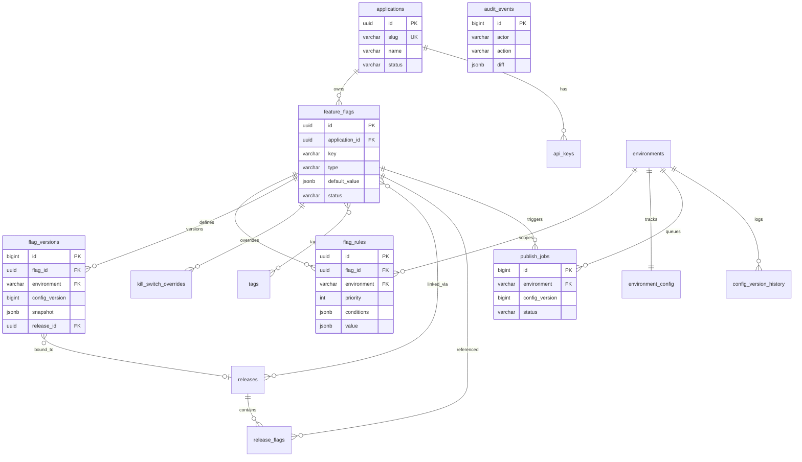

# Feature Management Service — Database Schema Design

| Attribute | Value |
|-----------|-------|
| **Document Version** | 1.0 |
| **Status** | Draft |
| **Created** | 2026-06-25 |
| **Database** | PostgreSQL 18.4 |
| **Migration Tool** | Flyway 12.4.0 |
| **Related Documents** | [BRD](./Feature_Management_Service_BRD.md) · [Technical Architecture](./Feature_Management_Service_Technical_Architecture.md) · [Redis Cache Design](./Feature_Management_Service_Redis_Cache_Design.md) · [Technology Stack](./Feature_Management_Service_Technology_Stack.md) |

---

## 1. Purpose

This document defines the **PostgreSQL relational data model** for the Feature Management Service (FMS). It serves as the authoritative table-structure reference during implementation. It covers:

- Entity relationships and table inventory
- Column definitions, constraints, and indexing strategy
- JSONB column structure conventions
- Version numbering and publish Outbox mechanics
- Responsibility boundaries between PostgreSQL and the Redis cache layer

**Out of scope**: Redis key patterns and cache design are documented in [Redis Cache Design](./Feature_Management_Service_Redis_Cache_Design.md). Explain results are computed at runtime and are **not persisted**.

---

## 2. Design Principles

| Principle | Description |
|-----------|-------------|
| **Control-plane strong consistency** | Management writes commit in a single transaction; `flag_versions`, `audit_events`, and `publish_jobs` are written together |
| **Immutable versions** | Published `flag_versions` rows are append-only; rollback = publish a new version from an old snapshot |
| **Environment isolation** | `config_version` increments monotonically per **environment**; environments are independent |
| **Per-application subscription** | All flags belong to `applications`; SDKs subscribe to a subset by `appId` |
| **Append-only audit** | `audit_events` forbids UPDATE/DELETE (application layer + optional DB triggers) |
| **No plaintext secrets in storage** | API keys store hashes only; large sensitive lists (e.g., user IDs) use an external Segment service (MVP may inline in JSONB with size limits) |

---

## 3. Entity Relationship Diagram (ERD)



---

## 4. Table Inventory

| # | Table | Type | Description |
|---|-------|------|-------------|
| 1 | `environments` | Reference | Environment definitions (dev / staging / prod) |
| 2 | `applications` | Master | Applications/services onboarded to FMS |
| 3 | `api_keys` | Master | Data-plane API keys (hashed storage) |
| 4 | `tags` | Master | Tag dictionary |
| 5 | `feature_flags` | Core | Feature flag metadata |
| 6 | `feature_flag_tags` | Junction | Flag ↔ Tag many-to-many |
| 7 | `flag_rules` | Core | Editable rules (pre-publish working copy) |
| 8 | `flag_environment_state` | Core | Per-environment publish state per flag |
| 9 | `releases` | Master | Release ticket / version association |
| 10 | `release_flags` | Junction | Release ↔ Flag binding |
| 11 | `flag_versions` | Core | Immutable published snapshot history |
| 12 | `environment_config` | Core | Per-environment current `config_version` pointer |
| 13 | `config_version_history` | Auxiliary | Environment-level version change log (incremental sync metadata) |
| 14 | `kill_switch_overrides` | Core | Emergency kill switch (global / regional) |
| 15 | `publish_jobs` | Outbox | Async publish job queue |
| 16 | `audit_events` | Audit | Management-plane audit log |
| 17 | `idempotency_records` | Auxiliary | Management API idempotency cache |

---

## 5. Enums and Domain Types

### 5.1 PostgreSQL ENUM Types

> **Implementation note (V3 migration)**: Runtime columns use `VARCHAR(32)` for JPA/Hibernate compatibility. The ENUM definitions below remain the authoritative value set.

```sql
CREATE TYPE flag_status AS ENUM ('draft', 'published', 'archived');

CREATE TYPE flag_type AS ENUM ('boolean', 'string', 'number', 'json');

CREATE TYPE application_status AS ENUM ('active', 'inactive', 'suspended');

CREATE TYPE publish_job_status AS ENUM (
    'pending', 'processing', 'completed', 'failed', 'cancelled'
);

CREATE TYPE kill_switch_scope AS ENUM ('global', 'region');

CREATE TYPE audit_action AS ENUM (
    'create', 'update', 'delete', 'publish', 'rollback',
    'promote', 'archive', 'kill_switch_on', 'kill_switch_off'
);
```

### 5.2 Naming Conventions

| Convention | Rule |
|------------|------|
| Primary keys | `UUID` (`gen_random_uuid()`) for business entities; `BIGSERIAL` for high-write log tables |
| Timestamps | `TIMESTAMPTZ`, always UTC |
| Soft delete | Not used; archival via `flag_status = 'archived'` |
| FK on delete | `RESTRICT` for business entities; `CASCADE` for junction tables; `RESTRICT` for audit/history |

---

## 6. Detailed Table Definitions

### 6.1 `environments` — Environments

| Column | Type | Constraints | Description |
|--------|------|-------------|-------------|
| `name` | `VARCHAR(32)` | PK | Environment identifier: `dev`, `staging`, `prod` |
| `display_name` | `VARCHAR(64)` | NOT NULL | Display name |
| `sort_order` | `SMALLINT` | NOT NULL DEFAULT 0 | Sort order (promote direction) |
| `is_production` | `BOOLEAN` | NOT NULL DEFAULT FALSE | Whether this is a production environment |
| `created_at` | `TIMESTAMPTZ` | NOT NULL DEFAULT `now()` | Created timestamp |

**Seed data**: `dev`, `staging`, `prod` (`prod.is_production = true`).

---

### 6.2 `applications` — Applications

| Column | Type | Constraints | Description |
|--------|------|-------------|-------------|
| `id` | `UUID` | PK, DEFAULT `gen_random_uuid()` | Primary key |
| `slug` | `VARCHAR(64)` | NOT NULL, UNIQUE | `appId` used by SDK/API |
| `name` | `VARCHAR(128)` | NOT NULL | Application name |
| `description` | `TEXT` | | Description |
| `status` | `application_status` | NOT NULL DEFAULT `'active'` | Status |
| `owner_team` | `VARCHAR(128)` | | Owning team |
| `created_by` | `VARCHAR(256)` | NOT NULL | Creator (OIDC subject or email) |
| `created_at` | `TIMESTAMPTZ` | NOT NULL DEFAULT `now()` | |
| `updated_at` | `TIMESTAMPTZ` | NOT NULL DEFAULT `now()` | |

**Indexes**:

```sql
CREATE INDEX idx_applications_status ON applications (status);
CREATE INDEX idx_applications_slug ON applications (slug);  -- covered by UNIQUE; explicit for documentation
```

---

### 6.3 `api_keys` — API Keys

| Column | Type | Constraints | Description |
|--------|------|-------------|-------------|
| `id` | `UUID` | PK | Primary key |
| `application_id` | `UUID` | NOT NULL, FK → `applications(id)` ON DELETE RESTRICT | Owning application |
| `name` | `VARCHAR(128)` | NOT NULL | Key purpose description |
| `key_prefix` | `VARCHAR(12)` | NOT NULL | Plaintext prefix for identification (e.g., `fms_a1b2`) |
| `key_hash` | `VARCHAR(128)` | NOT NULL | Argon2/bcrypt hash; **never store plaintext** |
| `scopes` | `JSONB` | NOT NULL DEFAULT `'["sync","evaluate"]'` | Permission scopes |
| `expires_at` | `TIMESTAMPTZ` | | Expiration time |
| `revoked_at` | `TIMESTAMPTZ` | | Revocation time |
| `created_by` | `VARCHAR(256)` | NOT NULL | |
| `created_at` | `TIMESTAMPTZ` | NOT NULL DEFAULT `now()` | |
| `last_used_at` | `TIMESTAMPTZ` | | Last used timestamp |

**Indexes**:

```sql
CREATE INDEX idx_api_keys_application ON api_keys (application_id);
CREATE INDEX idx_api_keys_prefix ON api_keys (key_prefix);
CREATE INDEX idx_api_keys_active ON api_keys (application_id)
    WHERE revoked_at IS NULL AND (expires_at IS NULL OR expires_at > now());
```

---

### 6.4 `tags` — Tags

| Column | Type | Constraints | Description |
|--------|------|-------------|-------------|
| `id` | `UUID` | PK | |
| `name` | `VARCHAR(64)` | NOT NULL, UNIQUE | Tag name (normalized lowercase) |
| `created_at` | `TIMESTAMPTZ` | NOT NULL DEFAULT `now()` | |

---

### 6.5 `feature_flags` — Feature Flags

| Column | Type | Constraints | Description |
|--------|------|-------------|-------------|
| `id` | `UUID` | PK | |
| `application_id` | `UUID` | NOT NULL, FK → `applications(id)` ON DELETE RESTRICT | Owning application |
| `key` | `VARCHAR(128)` | NOT NULL | Unique flag key (unique per application) |
| `name` | `VARCHAR(256)` | NOT NULL | Display name |
| `description` | `TEXT` | | Description |
| `type` | `flag_type` | NOT NULL DEFAULT `'boolean'` | Value type |
| `default_value` | `JSONB` | NOT NULL | Default value (e.g., `false`, `"control"`) |
| `status` | `flag_status` | NOT NULL DEFAULT `'draft'` | Global lifecycle status |
| `rollout_salt` | `VARCHAR(64)` | NOT NULL | Stable bucketing salt (written into snapshot on publish) |
| `created_by` | `VARCHAR(256)` | NOT NULL | |
| `updated_by` | `VARCHAR(256)` | | |
| `created_at` | `TIMESTAMPTZ` | NOT NULL DEFAULT `now()` | |
| `updated_at` | `TIMESTAMPTZ` | NOT NULL DEFAULT `now()` | |

**Constraints**:

```sql
ALTER TABLE feature_flags
    ADD CONSTRAINT uq_feature_flags_app_key UNIQUE (application_id, key);

ALTER TABLE feature_flags
    ADD CONSTRAINT chk_feature_flags_key_format
    CHECK (key ~ '^[a-z][a-z0-9_]{0,127}$');
```

**Indexes**:

```sql
CREATE INDEX idx_feature_flags_application ON feature_flags (application_id);
CREATE INDEX idx_feature_flags_status ON feature_flags (status);
CREATE INDEX idx_feature_flags_app_status ON feature_flags (application_id, status);
```

---

### 6.6 `feature_flag_tags` — Flag–Tag Association

| Column | Type | Constraints | Description |
|--------|------|-------------|-------------|
| `flag_id` | `UUID` | PK, FK → `feature_flags(id)` ON DELETE CASCADE | |
| `tag_id` | `UUID` | PK, FK → `tags(id)` ON DELETE CASCADE | |
| `created_at` | `TIMESTAMPTZ` | NOT NULL DEFAULT `now()` | |

```sql
CREATE INDEX idx_feature_flag_tags_tag ON feature_flag_tags (tag_id);
```

---

### 6.7 `flag_rules` — Evaluation Rules (Working Copy)

Editable rule drafts via the Management API; **on publish**, compiled into `flag_versions.snapshot`. Runtime evaluation uses published snapshots.

| Column | Type | Constraints | Description |
|--------|------|-------------|-------------|
| `id` | `UUID` | PK | |
| `flag_id` | `UUID` | NOT NULL, FK → `feature_flags(id)` ON DELETE CASCADE | |
| `environment` | `VARCHAR(32)` | NOT NULL, FK → `environments(name)` | Target environment |
| `priority` | `INTEGER` | NOT NULL | Priority; evaluated in **ascending** order; first match wins |
| `name` | `VARCHAR(128)` | | Rule name |
| `conditions` | `JSONB` | NOT NULL DEFAULT `'{}'` | Match conditions (see §8.1) |
| `value` | `JSONB` | NOT NULL | Return value when matched |
| `is_enabled` | `BOOLEAN` | NOT NULL DEFAULT TRUE | Whether rule participates in evaluation |
| `schedule_start` | `TIMESTAMPTZ` | | Scheduled activation start (P2) |
| `schedule_end` | `TIMESTAMPTZ` | | Scheduled activation end |
| `created_at` | `TIMESTAMPTZ` | NOT NULL DEFAULT `now()` | |
| `updated_at` | `TIMESTAMPTZ` | NOT NULL DEFAULT `now()` | |

**Constraints**:

```sql
ALTER TABLE flag_rules
    ADD CONSTRAINT uq_flag_rules_flag_env_priority
    UNIQUE (flag_id, environment, priority);

ALTER TABLE flag_rules
    ADD CONSTRAINT chk_flag_rules_priority_nonneg
    CHECK (priority >= 0);
```

**Indexes**:

```sql
CREATE INDEX idx_flag_rules_flag_env ON flag_rules (flag_id, environment);
CREATE INDEX idx_flag_rules_conditions ON flag_rules USING GIN (conditions);
```

---

### 6.8 `flag_environment_state` — Per-Environment Publish State

| Column | Type | Constraints | Description |
|--------|------|-------------|-------------|
| `flag_id` | `UUID` | PK, FK → `feature_flags(id)` ON DELETE CASCADE | |
| `environment` | `VARCHAR(32)` | PK, FK → `environments(name)` | |
| `is_published` | `BOOLEAN` | NOT NULL DEFAULT FALSE | Whether published in this environment |
| `latest_version_id` | `BIGINT` | FK → `flag_versions(id)` ON DELETE SET NULL | Currently active version |
| `draft_dirty` | `BOOLEAN` | NOT NULL DEFAULT TRUE | Whether rules have unpublished changes |
| `updated_at` | `TIMESTAMPTZ` | NOT NULL DEFAULT `now()` | |

```sql
CREATE INDEX idx_flag_env_state_env_published
    ON flag_environment_state (environment, is_published)
    WHERE is_published = TRUE;
```

---

### 6.9 `releases` — Releases

| Column | Type | Constraints | Description |
|--------|------|-------------|-------------|
| `id` | `UUID` | PK | |
| `release_id` | `VARCHAR(128)` | NOT NULL, UNIQUE | External release ticket ID (e.g., `REL-2026-06-25-checkout`) |
| `version` | `VARCHAR(64)` | NOT NULL | Semantic version or build number |
| `title` | `VARCHAR(256)` | | Title |
| `description` | `TEXT` | | |
| `metadata` | `JSONB` | NOT NULL DEFAULT `'{}'` | CI/CD metadata |
| `created_by` | `VARCHAR(256)` | NOT NULL | |
| `created_at` | `TIMESTAMPTZ` | NOT NULL DEFAULT `now()` | |

```sql
CREATE INDEX idx_releases_version ON releases (version);
```

---

### 6.10 `release_flags` — Release–Flag Association

| Column | Type | Constraints | Description |
|--------|------|-------------|-------------|
| `release_id` | `UUID` | PK, FK → `releases(id)` ON DELETE CASCADE | |
| `flag_id` | `UUID` | PK, FK → `feature_flags(id)` ON DELETE CASCADE | |
| `environment` | `VARCHAR(32)` | NOT NULL, FK → `environments(name)` | Bound environment |
| `config_version` | `BIGINT` | | Environment config version at bind time |
| `created_at` | `TIMESTAMPTZ` | NOT NULL DEFAULT `now()` | |

```sql
CREATE INDEX idx_release_flags_flag ON release_flags (flag_id);
```

---

### 6.11 `flag_versions` — Published Version Snapshots (Immutable)

| Column | Type | Constraints | Description |
|--------|------|-------------|-------------|
| `id` | `BIGSERIAL` | PK | |
| `flag_id` | `UUID` | NOT NULL, FK → `feature_flags(id)` ON DELETE RESTRICT | |
| `environment` | `VARCHAR(32)` | NOT NULL, FK → `environments(name)` | |
| `config_version` | `BIGINT` | NOT NULL | **Environment-level** monotonic version number |
| `flag_version` | `INTEGER` | NOT NULL | Per-flag version sequence (starts at 1) |
| `snapshot` | `JSONB` | NOT NULL | Compiled full snapshot (see §8.2) |
| `release_id` | `UUID` | FK → `releases(id)` ON DELETE SET NULL | Linked release |
| `comment` | `TEXT` | | Publish comment |
| `kill_switch` | `BOOLEAN` | NOT NULL DEFAULT FALSE | Whether this publish includes a kill switch |
| `published_by` | `VARCHAR(256)` | NOT NULL | |
| `published_at` | `TIMESTAMPTZ` | NOT NULL DEFAULT `now()` | |

**Constraints**:

```sql
ALTER TABLE flag_versions
    ADD CONSTRAINT uq_flag_versions_flag_env_version
    UNIQUE (flag_id, environment, flag_version);

ALTER TABLE flag_versions
    ADD CONSTRAINT uq_flag_versions_env_config_flag
    UNIQUE (environment, config_version, flag_id);
```

**Indexes**:

```sql
CREATE INDEX idx_flag_versions_flag_env ON flag_versions (flag_id, environment, flag_version DESC);
CREATE INDEX idx_flag_versions_env_config ON flag_versions (environment, config_version DESC);
CREATE INDEX idx_flag_versions_published_at ON flag_versions (published_at DESC);
CREATE INDEX idx_flag_versions_release ON flag_versions (release_id) WHERE release_id IS NOT NULL;
```

---

### 6.12 `environment_config` — Current Environment Version

| Column | Type | Constraints | Description |
|--------|------|-------------|-------------|
| `environment` | `VARCHAR(32)` | PK, FK → `environments(name)` | |
| `current_config_version` | `BIGINT` | NOT NULL DEFAULT 0 | Current latest config version |
| `updated_at` | `TIMESTAMPTZ` | NOT NULL DEFAULT `now()` | |

> On publish, within the same transaction: `current_config_version = current_config_version + 1` to ensure monotonic increment.

---

### 6.13 `config_version_history` — Environment Version Log

Records metadata for each `config_version` increment; supports incremental sync and Explain replay.

| Column | Type | Constraints | Description |
|--------|------|-------------|-------------|
| `id` | `BIGSERIAL` | PK | |
| `environment` | `VARCHAR(32)` | NOT NULL, FK → `environments(name)` | |
| `config_version` | `BIGINT` | NOT NULL | |
| `changed_flag_ids` | `UUID[]` | NOT NULL | Flag IDs changed in this version |
| `deleted_flag_keys` | `TEXT[]` | NOT NULL DEFAULT `'{}'` | Flag keys deleted/archived in this version |
| `publish_job_id` | `BIGINT` | FK → `publish_jobs(id)` ON DELETE SET NULL | |
| `created_at` | `TIMESTAMPTZ` | NOT NULL DEFAULT `now()` | |

**Constraints**:

```sql
ALTER TABLE config_version_history
    ADD CONSTRAINT uq_config_version_history_env_version
    UNIQUE (environment, config_version);
```

**Indexes**:

```sql
CREATE INDEX idx_config_version_history_env_created
    ON config_version_history (environment, created_at DESC);
```

**Retention policy**: Retain the most recent **500** versions (configurable); beyond that, SDKs must perform a full sync.

---

### 6.14 `kill_switch_overrides` — Emergency Kill Switch

| Column | Type | Constraints | Description |
|--------|------|-------------|-------------|
| `id` | `UUID` | PK | |
| `flag_id` | `UUID` | NOT NULL, FK → `feature_flags(id)` ON DELETE CASCADE | |
| `environment` | `VARCHAR(32)` | NOT NULL, FK → `environments(name)` | |
| `scope` | `kill_switch_scope` | NOT NULL | `global` or `region` |
| `region_code` | `VARCHAR(8)` | | Required when `scope=region` (ISO 3166-1 alpha-2) |
| `is_active` | `BOOLEAN` | NOT NULL DEFAULT TRUE | Whether override is active |
| `forced_value` | `JSONB` | NOT NULL DEFAULT `'false'` | Forced return value (typically `false`) |
| `activated_by` | `VARCHAR(256)` | NOT NULL | |
| `activated_at` | `TIMESTAMPTZ` | NOT NULL DEFAULT `now()` | |
| `deactivated_at` | `TIMESTAMPTZ` | | Deactivation time |
| `deactivated_by` | `VARCHAR(256)` | | |

**Constraints**:

```sql
ALTER TABLE kill_switch_overrides
    ADD CONSTRAINT chk_kill_switch_region
    CHECK (
        (scope = 'global' AND region_code IS NULL) OR
        (scope = 'region' AND region_code IS NOT NULL)
    );
```

**Indexes**:

```sql
CREATE INDEX idx_kill_switch_active
    ON kill_switch_overrides (environment, flag_id)
    WHERE is_active = TRUE;
```

---

### 6.15 `publish_jobs` — Publish Outbox

Transactional Outbox pattern; consumed asynchronously by the Publish Worker after Management API commit.

| Column | Type | Constraints | Description |
|--------|------|-------------|-------------|
| `id` | `BIGSERIAL` | PK | |
| `flag_id` | `UUID` | NOT NULL, FK → `feature_flags(id)` ON DELETE RESTRICT | |
| `flag_key` | `VARCHAR(128)` | NOT NULL | Denormalized for worker logs and monitoring |
| `environment` | `VARCHAR(32)` | NOT NULL, FK → `environments(name)` | |
| `config_version` | `BIGINT` | NOT NULL | Allocated environment version number |
| `flag_version_id` | `BIGINT` | FK → `flag_versions(id)` ON DELETE RESTRICT | Linked snapshot row |
| `job_type` | `VARCHAR(32)` | NOT NULL DEFAULT `'publish'` | `publish` / `rollback` / `promote` |
| `payload` | `JSONB` | NOT NULL | Compilation context required by worker |
| `status` | `publish_job_status` | NOT NULL DEFAULT `'pending'` | |
| `attempt_count` | `SMALLINT` | NOT NULL DEFAULT 0 | |
| `max_attempts` | `SMALLINT` | NOT NULL DEFAULT 5 | |
| `locked_by` | `VARCHAR(128)` | | Worker instance ID |
| `locked_at` | `TIMESTAMPTZ` | | |
| `next_retry_at` | `TIMESTAMPTZ` | NOT NULL DEFAULT `now()` | |
| `error_message` | `TEXT` | | Most recent failure reason |
| `created_at` | `TIMESTAMPTZ` | NOT NULL DEFAULT `now()` | |
| `completed_at` | `TIMESTAMPTZ` | | |

**Indexes**:

```sql
-- Worker polling: pending and retryable
CREATE INDEX idx_publish_jobs_pending
    ON publish_jobs (next_retry_at)
    WHERE status IN ('pending', 'failed') AND attempt_count < max_attempts;

CREATE INDEX idx_publish_jobs_env_version ON publish_jobs (environment, config_version);
CREATE INDEX idx_publish_jobs_flag ON publish_jobs (flag_id, created_at DESC);
```

**Worker claim SQL (reference)**:

```sql
UPDATE publish_jobs
SET status = 'processing',
    locked_by = :workerId,
    locked_at = now(),
    attempt_count = attempt_count + 1
WHERE id = (
    SELECT id FROM publish_jobs
    WHERE status IN ('pending', 'failed')
      AND attempt_count < max_attempts
      AND next_retry_at <= now()
    ORDER BY created_at
    FOR UPDATE SKIP LOCKED
    LIMIT 1
)
RETURNING *;
```

---

### 6.16 `audit_events` — Audit Log

| Column | Type | Constraints | Description |
|--------|------|-------------|-------------|
| `id` | `BIGSERIAL` | PK | |
| `actor` | `VARCHAR(256)` | NOT NULL | Actor |
| `actor_ip_hash` | `VARCHAR(64)` | | Hashed request IP (not plaintext IP) |
| `action` | `audit_action` | NOT NULL | Action type |
| `resource_type` | `VARCHAR(64)` | NOT NULL | e.g., `feature_flag`, `release` |
| `resource_id` | `VARCHAR(256)` | NOT NULL | Resource identifier |
| `environment` | `VARCHAR(32)` | | Related environment |
| `request_id` | `VARCHAR(64)` | | `X-Request-Id` correlation |
| `diff` | `JSONB` | NOT NULL | Before/after diff |
| `metadata` | `JSONB` | NOT NULL DEFAULT `'{}'` | Extension fields |
| `created_at` | `TIMESTAMPTZ` | NOT NULL DEFAULT `now()` | |

**Indexes**:

```sql
CREATE INDEX idx_audit_events_created ON audit_events (created_at DESC);
CREATE INDEX idx_audit_events_resource ON audit_events (resource_type, resource_id);
CREATE INDEX idx_audit_events_actor ON audit_events (actor, created_at DESC);
CREATE INDEX idx_audit_events_action ON audit_events (action, created_at DESC);
```

**Retention policy**: Online retention **13 months**; older records archived to cold storage (S3 / audit platform).

---

### 6.17 `idempotency_records` — Management API Idempotency

Caches successful Management API responses keyed by `Idempotency-Key` header and request operation identity.

| Column | Type | Constraints | Description |
|--------|------|-------------|-------------|
| `id` | `UUID` | PK | |
| `idempotency_key` | `VARCHAR(128)` | NOT NULL | Client-supplied idempotency key |
| `operation_key` | `VARCHAR(512)` | NOT NULL | `METHOD path[?query]` operation identity |
| `response_status` | `INT` | NOT NULL | Cached HTTP status |
| `response_body` | `JSONB` | NOT NULL | Cached response body |
| `response_headers` | `JSONB` | | Cached response headers |
| `created_at` | `TIMESTAMPTZ` | NOT NULL DEFAULT `now()` | |
| `expires_at` | `TIMESTAMPTZ` | NOT NULL | TTL expiry |

**Constraints**:

```sql
CONSTRAINT uq_idempotency_key_operation UNIQUE (idempotency_key, operation_key)
```

**Indexes**:

```sql
CREATE INDEX idx_idempotency_records_expires_at ON idempotency_records (expires_at);
```

> **Note**: The legacy `idempotency_keys` table from early migrations was removed in `V5__schema_cleanup_and_indexes.sql`.

---

## 7. Version Number Model

```
environment_config.current_config_version  (one counter per environment)
        │
        │  +1 on each publish transaction
        ▼
config_version_history  (records which flags changed)
        │
        ├── flag_versions.config_version  (each flag snapshot tagged with same version)
        └── publish_jobs.config_version   (Outbox carries version number)
```

| Concept | Scope | Description |
|---------|-------|-------------|
| `config_version` | Per **environment** | SDK incremental sync watermark; `GET /snapshot?sinceVersion=N` |
| `flag_version` | Per **flag × environment** | Per-flag publish history sequence; used for rollback |
| `flag_versions.id` | Global | Snapshot row PK; referenced by `flag_environment_state.latest_version_id` |

**Publish transaction boundary** (single-flag publish):

1. `SELECT current_config_version FROM environment_config WHERE environment = :env FOR UPDATE`
2. `new_version = current + 1`
3. `INSERT flag_versions (... config_version = new_version ...)`
4. `UPDATE environment_config SET current_config_version = new_version`
5. `INSERT config_version_history (... changed_flag_ids = ARRAY[:flagId] ...)`
6. `INSERT publish_jobs (... status = 'pending' ...)`
7. `INSERT audit_events (...)`
8. `UPDATE flag_environment_state SET latest_version_id = ..., is_published = true, draft_dirty = false`
9. `COMMIT` → return `202 Accepted` + `configVersion`

---

## 8. JSONB Structure Conventions

### 8.1 `flag_rules.conditions` — Rule Conditions

```json
{
  "region": { "operator": "in", "values": ["US", "CA"] },
  "appVersion": { "operator": "semver_gte", "value": "3.2.0" },
  "userId": { "operator": "in", "values": ["usr_1", "usr_2"] },
  "segment": { "operator": "in_segment", "segmentId": "seg_gold_users" },
  "rolloutPercent": 5,
  "customAttributes": {
    "loyaltyTier": { "operator": "eq", "value": "gold" }
  }
}
```

| Field | Type | Description |
|-------|------|-------------|
| `region` | object | Geographic targeting |
| `appVersion` | object | Application version semver comparison |
| `userId` | object | User ID allowlist (small scale; large scale uses segment service) |
| `segment` | object | External user segment ID |
| `rolloutPercent` | number | 0–100, stable percentage rollout |
| `customAttributes` | object | Custom attribute matching |

**Allowed operators**: `eq`, `neq`, `in`, `not_in`, `semver_gte`, `semver_lte`, `in_segment`.

### 8.2 `flag_versions.snapshot` — Compiled Snapshot

```json
{
  "key": "checkout_v2",
  "type": "boolean",
  "defaultValue": false,
  "status": "published",
  "rolloutSalt": "a1b2c3d4e5f6",
  "rules": [
    {
      "id": "550e8400-e29b-41d4-a716-446655440000",
      "priority": 10,
      "conditions": { "region": { "operator": "in", "values": ["US", "CA"] }, "rolloutPercent": 5 },
      "value": true
    }
  ],
  "releaseId": "REL-2026-06-25-checkout",
  "killSwitchOverrides": []
}
```

### 8.3 `audit_events.diff` — Audit Diff

```json
{
  "before": { "status": "draft", "defaultValue": false },
  "after": { "status": "published", "defaultValue": false },
  "changedFields": ["status"]
}
```

### 8.4 `publish_jobs.payload` — Worker Payload

```json
{
  "applicationId": "550e8400-e29b-41d4-a716-446655440001",
  "applicationSlug": "checkout-service",
  "snapshot": { },
  "invalidateApps": ["checkout-service"]
}
```

---

## 9. Core Query Patterns and Index Mapping

| Access Scenario | Query Pattern | Primary Index |
|-----------------|---------------|---------------|
| Admin console flag list | `WHERE application_id = ? AND status = ?` | `idx_feature_flags_app_status` |
| Filter by tag | `JOIN feature_flag_tags` | `idx_feature_flag_tags_tag` |
| SDK incremental sync | `config_version_history WHERE environment = ? AND config_version > ?` | `uq_config_version_history_env_version` |
| Load flag rules (edit) | `flag_rules WHERE flag_id = ? AND environment = ? ORDER BY priority` | `idx_flag_rules_flag_env` |
| Explain replay | `flag_versions WHERE environment = ? AND config_version = ?` | `idx_flag_versions_env_config` |
| Active kill switch | `kill_switch_overrides WHERE environment = ? AND is_active` | `idx_kill_switch_active` |
| Worker Outbox consumption | `publish_jobs WHERE status IN ('pending','failed')` | `idx_publish_jobs_pending` |
| Audit query | `audit_events WHERE resource_type = ? AND created_at BETWEEN` | `idx_audit_events_resource` |

---

## 10. PostgreSQL vs Redis Responsibilities

| Data | PostgreSQL | Redis |
|------|------------|-------|
| Flag definitions and rule source data | ✅ Source of truth | ❌ |
| Compiled snapshots (hot path) | ✅ Historical archive (`flag_versions.snapshot`) | ✅ Current serving snapshot `fms:snap:{env}:{appId}:v{version}` |
| Current environment version | ✅ `environment_config` | ✅ Pointer key `fms:snap:{env}:{appId}:current` |
| Incremental deltas | ✅ `config_version_history` metadata | ✅ Optional precomputed deltas |
| Audit log | ✅ | ❌ |
| Explain results | ❌ Computed at runtime | ❌ |

---

## 11. Initial DDL Script Structure (Flyway)

Recommended migration file naming:

```
db/migration/
├── V1__create_extensions_and_enums.sql
├── V2__create_reference_tables.sql          -- environments, tags
├── V3__create_applications_and_api_keys.sql
├── V4__create_feature_flags_and_rules.sql
├── V5__create_versions_and_environment_config.sql
├── V6__create_releases.sql
├── V7__create_kill_switch_and_publish_jobs.sql
├── V8__create_audit_events.sql
├── V9__create_indexes.sql
└── R__seed_environments.sql                 -- repeatable: dev/staging/prod
```

### 11.1 Extensions and Functions (V1 Summary)

```sql
CREATE EXTENSION IF NOT EXISTS "pgcrypto";  -- gen_random_uuid()

CREATE OR REPLACE FUNCTION set_updated_at()
RETURNS TRIGGER AS $$
BEGIN
    NEW.updated_at = now();
    RETURN NEW;
END;
$$ LANGUAGE plpgsql;

-- Apply to tables with updated_at
CREATE TRIGGER trg_applications_updated_at
    BEFORE UPDATE ON applications
    FOR EACH ROW EXECUTE FUNCTION set_updated_at();
-- ... feature_flags, flag_rules, flag_environment_state, environment_config
```

---

## 12. Capacity and Scale Estimates

| Metric | Initial Target | Table Impact |
|--------|----------------|--------------|
| Applications | 100+ | `applications` ~100 rows |
| Total flags | 5,000+ | `feature_flags` ~5k–50k rows |
| Rules | ~3 rules/flag | `flag_rules` ~15k–150k rows |
| Publish frequency | ~50/day/environment | `flag_versions` ~50k rows/year |
| Audit | Full recording | `audit_events` grows fastest; partitioning or archival required |

**`flag_versions` partitioning recommendation** (Phase 2): Monthly RANGE partition on `published_at`.

**`audit_events` partitioning recommendation**: Monthly partition on `created_at`, with automatic detach + archive.

---

## 13. Security and Compliance

| Requirement | Implementation |
|-------------|----------------|
| API keys not stored in plaintext | `api_keys.key_hash` + `key_prefix` |
| Tamper-evident audit | INSERT only; application service account has no UPDATE/DELETE |
| PII minimization | `audit_events` does not record full userId lists; `actor_ip_hash` replaces plaintext IP |
| Encryption in transit and at rest | PostgreSQL TDE / cloud RDS encryption; sensitive `conditions` may use application-layer AES-256-GCM |
| Backup | Daily full backup + continuous WAL archiving; RPO ≤ 5 min |

---

## 14. Open Questions

| # | Question | Affected Tables |
|---|----------|-----------------|
| 1 | Should large user segments be externalized to a Segment service? | `flag_rules.conditions.segment` |
| 2 | `config_version_history` retention window: 100 vs 500? | Incremental sync compatibility |
| 3 | Multi-region writes: single primary vs multi-primary conflict resolution? | `environment_config` write path |
| 4 | Should `flag_versions` store compressed binary instead of JSONB? | Storage vs Explain query complexity |

---

## 15. Appendix: Full CREATE TABLE SQL (MVP)

> Executable DDL summary for MVP; full migrations should live in Flyway scripts.

```sql
-- See §6 for full column definitions; core table CREATE skeleton below

CREATE TABLE environments (
    name         VARCHAR(32)  PRIMARY KEY,
    display_name VARCHAR(64)  NOT NULL,
    sort_order   SMALLINT     NOT NULL DEFAULT 0,
    is_production BOOLEAN     NOT NULL DEFAULT FALSE,
    created_at   TIMESTAMPTZ  NOT NULL DEFAULT now()
);

CREATE TABLE applications (
    id           UUID PRIMARY KEY DEFAULT gen_random_uuid(),
    slug         VARCHAR(64)  NOT NULL UNIQUE,
    name         VARCHAR(128) NOT NULL,
    description  TEXT,
    status       application_status NOT NULL DEFAULT 'active',
    owner_team   VARCHAR(128),
    created_by   VARCHAR(256) NOT NULL,
    created_at   TIMESTAMPTZ  NOT NULL DEFAULT now(),
    updated_at   TIMESTAMPTZ  NOT NULL DEFAULT now()
);

CREATE TABLE feature_flags (
    id              UUID PRIMARY KEY DEFAULT gen_random_uuid(),
    application_id  UUID NOT NULL REFERENCES applications(id) ON DELETE RESTRICT,
    key             VARCHAR(128) NOT NULL,
    name            VARCHAR(256) NOT NULL,
    description     TEXT,
    type            flag_type NOT NULL DEFAULT 'boolean',
    default_value   JSONB NOT NULL,
    status          flag_status NOT NULL DEFAULT 'draft',
    rollout_salt    VARCHAR(64) NOT NULL,
    created_by      VARCHAR(256) NOT NULL,
    updated_by      VARCHAR(256),
    created_at      TIMESTAMPTZ NOT NULL DEFAULT now(),
    updated_at      TIMESTAMPTZ NOT NULL DEFAULT now(),
    CONSTRAINT uq_feature_flags_app_key UNIQUE (application_id, key)
);

CREATE TABLE flag_versions (
    id              BIGSERIAL PRIMARY KEY,
    flag_id         UUID NOT NULL REFERENCES feature_flags(id) ON DELETE RESTRICT,
    environment     VARCHAR(32) NOT NULL REFERENCES environments(name),
    config_version  BIGINT NOT NULL,
    flag_version    INTEGER NOT NULL,
    snapshot        JSONB NOT NULL,
    release_id      UUID REFERENCES releases(id) ON DELETE SET NULL,
    comment         TEXT,
    kill_switch     BOOLEAN NOT NULL DEFAULT FALSE,
    published_by    VARCHAR(256) NOT NULL,
    published_at    TIMESTAMPTZ NOT NULL DEFAULT now(),
    CONSTRAINT uq_flag_versions_flag_env_version UNIQUE (flag_id, environment, flag_version),
    CONSTRAINT uq_flag_versions_env_config_flag UNIQUE (environment, config_version, flag_id)
);

CREATE TABLE environment_config (
    environment            VARCHAR(32) PRIMARY KEY REFERENCES environments(name),
    current_config_version BIGINT NOT NULL DEFAULT 0,
    updated_at             TIMESTAMPTZ NOT NULL DEFAULT now()
);

CREATE TABLE publish_jobs (
    id              BIGSERIAL PRIMARY KEY,
    flag_id         UUID NOT NULL REFERENCES feature_flags(id) ON DELETE RESTRICT,
    flag_key        VARCHAR(128) NOT NULL,
    environment     VARCHAR(32) NOT NULL REFERENCES environments(name),
    config_version  BIGINT NOT NULL,
    flag_version_id BIGINT REFERENCES flag_versions(id) ON DELETE RESTRICT,
    job_type        VARCHAR(32) NOT NULL DEFAULT 'publish',
    payload         JSONB NOT NULL,
    status          publish_job_status NOT NULL DEFAULT 'pending',
    attempt_count   SMALLINT NOT NULL DEFAULT 0,
    max_attempts    SMALLINT NOT NULL DEFAULT 5,
    locked_by       VARCHAR(128),
    locked_at       TIMESTAMPTZ,
    next_retry_at   TIMESTAMPTZ NOT NULL DEFAULT now(),
    error_message   TEXT,
    created_at      TIMESTAMPTZ NOT NULL DEFAULT now(),
    completed_at    TIMESTAMPTZ
);

CREATE TABLE audit_events (
    id            BIGSERIAL PRIMARY KEY,
    actor         VARCHAR(256) NOT NULL,
    actor_ip_hash VARCHAR(64),
    action        audit_action NOT NULL,
    resource_type VARCHAR(64) NOT NULL,
    resource_id   VARCHAR(256) NOT NULL,
    environment   VARCHAR(32),
    request_id    VARCHAR(64),
    diff          JSONB NOT NULL,
    metadata      JSONB NOT NULL DEFAULT '{}',
    created_at    TIMESTAMPTZ NOT NULL DEFAULT now()
);
```

---

## 16. References

- [Feature Management Service BRD](./Feature_Management_Service_BRD.md) — §10 Business Entities
- [Feature Management Service Technical Architecture](./Feature_Management_Service_Technical_Architecture.md) — §7 Caching, §11 Data Model
- [Feature Management Service Technology Stack](./Feature_Management_Service_Technology_Stack.md) — PostgreSQL / Flyway versions

---

*This document evolves with implementation. Schema changes must go through Flyway migration scripts and this document's version number must be updated accordingly.*
