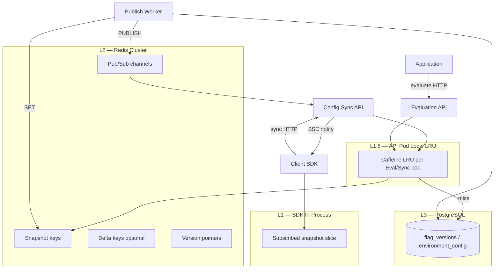
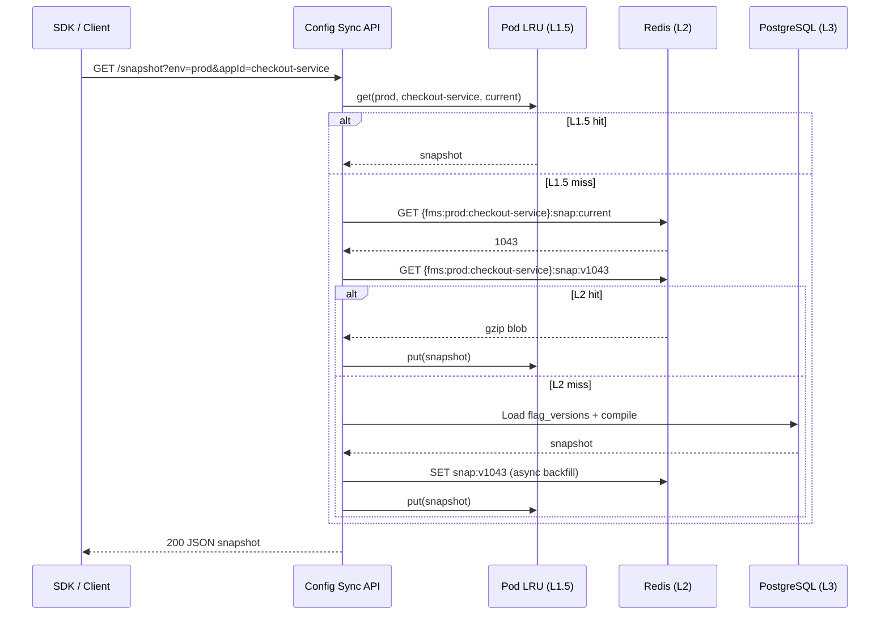
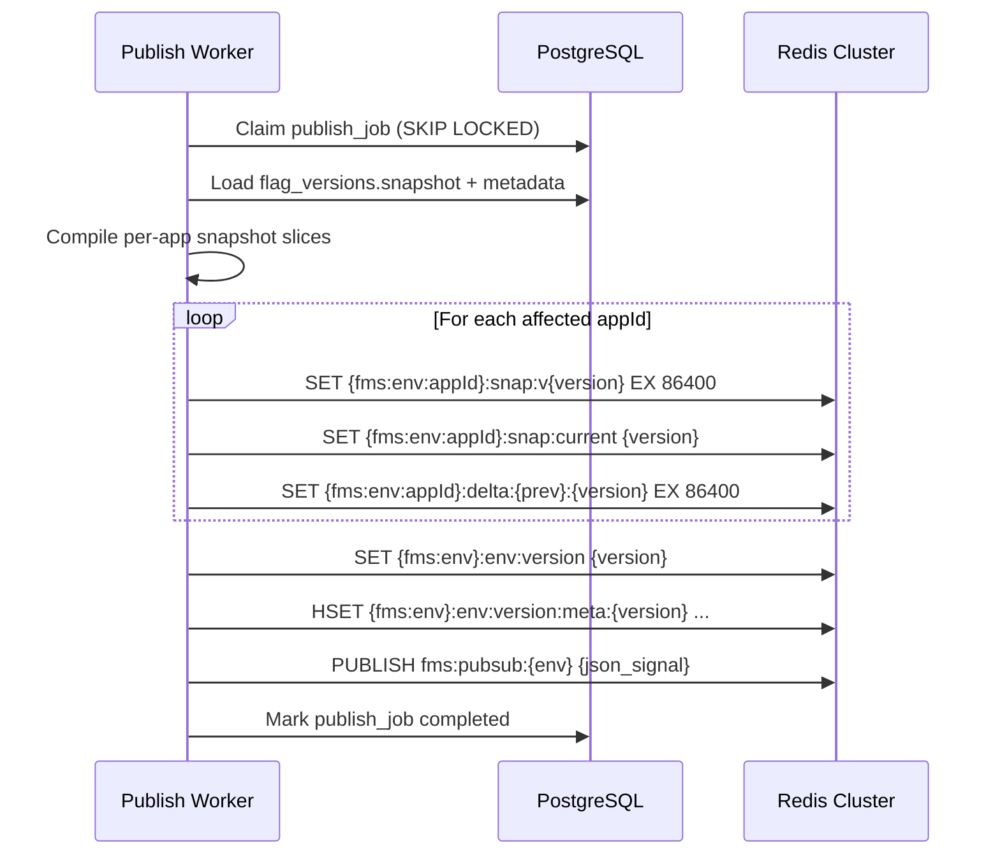

# Feature Management Service — Redis Cache Design

| Attribute | Value |
|-----------|-------|
| **Document Version** | 1.0 |
| **Status** | Draft |
| **Created** | 2026-06-25 |
| **Redis Version** | 8.8.0 (Valkey 9.1.0 alternative) |
| **Client Library** | Lettuce 7.5.2 / Spring Data Redis (Boot 4.1.0) |
| **Related Documents** | [BRD](./Feature_Management_Service_BRD.md) · [Technical Architecture](./Feature_Management_Service_Technical_Architecture.md) · [Database Schema](./Feature_Management_Service_Database_Schema.md) · [Technology Stack](./Feature_Management_Service_Technology_Stack.md) |

---

## 1. Purpose

This document specifies the **Redis distributed cache layer** for the Feature Management Service (FMS). Redis is the **L2 cache** in the multi-tier caching model: it serves compiled configuration snapshots to the Config Sync API and Evaluation API at low latency, and broadcasts version-change signals to connected clients.

**In scope**:

- Key namespace, value formats, and TTL policies
- Read/write paths for publish, sync, and remote evaluation
- Invalidation via Pub/Sub and version pointers
- Cluster topology, sharding, and capacity planning
- Failure modes, security, and observability

**Out of scope**:

- SDK in-process cache (L1) — see [Technical Architecture §9](./Feature_Management_Service_Technical_Architecture.md)
- PostgreSQL source-of-truth schema — see [Database Schema](./Feature_Management_Service_Database_Schema.md)
- Publish job queue (PostgreSQL Outbox, not Redis)

---

## 2. Design Principles

| Principle | Rationale |
|-----------|-----------|
| **Version-based coherence** | Correctness is driven by monotonic `configVersion`, not TTL expiry |
| **Per-app subscription** | Cache keys are scoped by `environment` + `appId`; clients never load the global catalog |
| **Write-on-publish, read-heavy** | Redis is populated by the Publish Worker; sync/eval paths are read-optimized |
| **Idempotent writes** | Worker retries are safe; same `config_version` must not corrupt state |
| **Pub/Sub as signal, not payload** | Channels carry version metadata only; clients fetch deltas via HTTP |
| **Bounded memory** | TTL on historical versions, delta retention window, snapshot size caps |
| **Fail open on read** | Redis outage → fall back to PostgreSQL + SDK local snapshot |

---

## 3. Multi-Tier Cache Architecture



| Tier | Location | Contents | Invalidation | Target Hit Rate |
|------|----------|----------|--------------|-----------------|
| **L1** | SDK in-process memory | Subscribed `appId` snapshot slice | On `configVersion` change | > 99.9% of evaluations |
| **L1.5** | Sync/Eval API pod (Caffeine) | Hot `(env, appId, version)` slices | Short TTL (30s) + version bump | > 90% within pod |
| **L2** | Redis Cluster | Compiled snapshots, version pointers, optional deltas | Overwrite on publish; historical TTL | > 99% of sync requests |
| **L3** | PostgreSQL | Authoritative definitions and version history | N/A | Cache miss only |

---

## 4. Redis Deployment Topology

### 4.1 Cluster Mode

| Aspect | Recommendation |
|--------|----------------|
| **Topology** | Redis Cluster 6+ nodes (3 primaries + 3 replicas minimum) |
| **Hosting** | AWS ElastiCache Redis Cluster / self-managed on EKS |
| **Persistence** | AOF everysec on primaries (recovery); snapshots are rebuildable from PostgreSQL |
| **Encryption** | TLS in transit; at-rest encryption enabled |
| **Auth** | ACL per service identity (`sync-api`, `eval-api`, `publish-worker`) |

### 4.2 Sharding Strategy

All FMS keys use a **hash tag** so related keys for the same `(environment, appId)` land on the same slot:

```
{fms:prod:checkout-service}:snap:current
{fms:prod:checkout-service}:snap:v1043
{fms:prod:checkout-service}:delta:1042:1043
```

**Hash tag pattern**: `{fms:{env}:{appId}}`

| Benefit | Explanation |
|---------|-------------|
| Co-location | `MGET` / pipeline for snapshot + pointer in one slot |
| Atomic multi-key updates | `MULTI`/`EXEC` within same slot on publish |
| Predictable hot spots | High-traffic apps isolated per shard |

**Environment-level keys** (no `appId`) use `{fms:{env}}` as the hash tag:

```
{fms:prod}:env:version
```

### 4.3 Multi-Region (Phase 2)

| Pattern | Use |
|---------|-----|
| **Primary region** | Publish Worker writes; source of truth for L2 |
| **Read replica** | Secondary region Sync/Eval APIs read locally |
| **Cross-region lag** | Acceptable for sync (≤ 60s P95 propagation KPI); SDK tolerates staleness via local snapshot |
| **Failover** | Promote replica; rebuild missing keys from PostgreSQL if needed |

---

## 5. Key Namespace

All keys are prefixed with `fms:` to avoid collisions in shared Redis instances.

### 5.1 Key Catalog

| Key Pattern | Type | Description |
|-------------|------|-------------|
| `{fms:{env}:{appId}}:snap:current` | String (integer) | Current `configVersion` for this app subscription |
| `{fms:{env}:{appId}}:snap:v{version}` | String (binary/JSON) | Full compiled snapshot blob for version N |
| `{fms:{env}:{appId}}:delta:{from}:{to}` | String (binary/JSON) | Precomputed delta from version `from` → `to` (optional) |
| `{fms:{env}}:env:version` | String (integer) | Environment-wide current `configVersion` |
| `{fms:{env}}:env:version:meta:{version}` | Hash | Version metadata: `changedApps`, `timestamp`, `publishJobId` |
| `{fms:{env}}:kill:{flagKey}` | String (JSON) | Active kill-switch cache (fast eval path) |
| `fms:pubsub:{env}` | Pub/Sub channel | Version-change broadcast (no hash tag — global per env) |
| `{fms:ratelimit:{appId}}:sync` | String (counter) | Sync API rate limit sliding window |
| `{fms:ratelimit:{appId}}:eval` | String (counter) | Evaluation API rate limit sliding window |
| `{fms:worker:lock:{publishJobId}}` | String | Short-lived idempotency lock (optional) |

### 5.2 Key Naming Rules

| Rule | Example |
|------|---------|
| Lowercase environment and appId | `prod`, `checkout-service` |
| Version numbers are unpadded integers | `v1043`, not `v0001043` |
| No PII in keys | Never embed `userId` in key names |
| Max key length | < 256 bytes (well within Redis limits) |

### 5.3 Example Keys

```
{fms:prod:checkout-service}:snap:current          →  "1043"
{fms:prod:checkout-service}:snap:v1043            →  <gzip-compressed JSON blob>
{fms:prod:checkout-service}:delta:1042:1043       →  <gzip-compressed delta JSON>
{fms:prod}:env:version                            →  "1043"
{fms:prod}:env:version:meta:1043                  →  { changedApps: ["checkout-service"], ... }
{fms:prod}:kill:checkout_v2                         →  {"scope":"global","forcedValue":false,...}
```

---

## 6. Value Formats

### 6.1 Snapshot Blob (`snap:v{version}`)

Compiled, evaluation-ready payload for a single `appId` subscription. Structure aligns with the Config Sync API response:

```json
{
  "environment": "prod",
  "appId": "checkout-service",
  "configVersion": 1043,
  "generatedAt": "2026-06-25T10:00:05Z",
  "flags": [
    {
      "key": "checkout_v2",
      "type": "boolean",
      "defaultValue": false,
      "status": "published",
      "rolloutSalt": "a1b2c3d4e5f6",
      "rules": [
        {
          "id": "550e8400-e29b-41d4-a716-446655440000",
          "priority": 10,
          "conditions": {
            "region": { "operator": "in", "values": ["US", "CA"] },
            "rolloutPercent": 5
          },
          "value": true
        }
      ],
      "releaseId": "REL-2026-06-25-checkout"
    }
  ]
}
```

| Aspect | Specification |
|--------|---------------|
| **Serialization** | JSON UTF-8, gzip-compressed before `SET` |
| **Content-Type header** (internal metadata) | Stored as separate hash field or leading magic byte `0x1F 0x8B` |
| **Max size** | 512 KB per snapshot (configurable per app); reject at publish if exceeded |
| **Excluded data** | Archived flags, flags not owned by `appId` |

### 6.2 Delta Blob (`delta:{from}:{to}`)

```json
{
  "environment": "prod",
  "appId": "checkout-service",
  "configVersion": 1043,
  "previousVersion": 1042,
  "syncType": "delta",
  "flags": [ ],
  "deletedFlagKeys": ["legacy_checkout"]
}
```

Precomputed by the Publish Worker for the last **N** version pairs (default N = 100). Built by diffing snapshot `from` and `to`.

### 6.3 Version Pointer (`snap:current`)

Plain integer string:

```
"1043"
```

Updated atomically in the same transaction slot as the new snapshot write.

### 6.4 Environment Version Metadata (`env:version:meta:{version}`)

Redis Hash fields:

| Field | Type | Description |
|-------|------|-------------|
| `configVersion` | string | Version number |
| `publishedAt` | string | ISO-8601 timestamp |
| `changedApps` | string | JSON array of `appId` slugs affected |
| `changedFlagKeys` | string | JSON array of flag keys changed |
| `deletedFlagKeys` | string | JSON array of removed keys |
| `publishJobId` | string | Source outbox job ID |

### 6.5 Pub/Sub Message (`fms:pubsub:{env}`)

Lightweight signal only — **not** the full snapshot:

```json
{
  "configVersion": 1043,
  "previousVersion": 1042,
  "environment": "prod",
  "changedApps": ["checkout-service"],
  "publishedAt": "2026-06-25T10:00:05Z"
}
```

Payload size target: < 1 KB.

### 6.6 Kill Switch Cache (`kill:{flagKey}`)

Denormalized active kill-switch state for fast Evaluation API lookup:

```json
{
  "flagKey": "checkout_v2",
  "scope": "region",
  "regionCode": "US",
  "forcedValue": false,
  "activatedAt": "2026-06-25T11:00:00Z"
}
```

TTL: none while active; key deleted on deactivation.

---

## 7. TTL and Eviction Policies

| Key Type | TTL | Rationale |
|----------|-----|-----------|
| `snap:v{current}` | **No TTL** | Active version; overwritten on next publish |
| `snap:v{historical}` | **24 hours** | Supports incremental sync within retention window |
| `delta:{from}:{to}` | **24 hours** | Matches snapshot retention |
| `snap:current` | **No TTL** | Pointer always reflects latest |
| `env:version` | **No TTL** | Environment watermark |
| `env:version:meta:{v}` | **7 days** | Metadata for debugging; rebuildable from PostgreSQL |
| `kill:{flagKey}` | **No TTL** (while active) | Explicit delete on deactivate |
| `ratelimit:*` | **1–60 seconds** | Sliding window expiry |
| `worker:lock:*` | **30 seconds** | Short idempotency guard |

### 7.1 Eviction Configuration

```conf
maxmemory-policy volatile-lru
maxmemory <cluster_limit>
```

| Policy | Why |
|--------|-----|
| `volatile-lru` | Only keys with TTL are evicted; current snapshots (no TTL) are protected |
| Memory alert | Alert at 75% `maxmemory`; scale cluster before hitting limit |

### 7.2 Retention Alignment

Redis historical TTL (24h) must align with PostgreSQL `config_version_history` retention (500 versions). If a client requests `sinceVersion` outside both windows, the Sync API returns a **full snapshot** rebuilt from PostgreSQL.

---

## 8. Read Paths

### 8.1 Config Sync API — Full Snapshot



### 8.2 Config Sync API — Incremental Delta

```
1. GET {fms:{env}:{appId}}:snap:current  →  currentVersion
2. IF client.sinceVersion >= currentVersion  →  304 Not Modified
3. IF currentVersion - sinceVersion > DELTA_MAX_GAP  →  full snapshot path
4. GET {fms:{env}:{appId}}:delta:{sinceVersion}:{currentVersion}
5. IF miss  →  compute delta from snap:v{since} + snap:v{current}, or fall back to PG
6. Return delta JSON
```

### 8.3 Evaluation API — Remote Evaluate

```
1. Resolve current version: GET snap:current
2. Load snapshot: GET snap:v{version} (via pod LRU)
3. Check kill switch: GET {fms:{env}}:kill:{flagKey} (optional fast path)
4. Run rule engine against snapshot in memory
5. Return evaluation result
```

### 8.4 HEAD /version (Lightweight Check)

```
GET {fms:{env}}:env:version
```

Returns environment-wide version without loading per-app snapshots. Used by clients polling for changes.

---

## 9. Write Paths

### 9.1 Publish Worker — Snapshot Write

Triggered after claiming a `publish_jobs` row from PostgreSQL.



### 9.2 Atomic Write Pattern (Same Slot)

Because `snap:current` and `snap:v{version}` share the hash tag `{fms:{env}:{appId}}`, the worker uses a Redis transaction:

```redis
MULTI
SET {fms:prod:checkout-service}:snap:v1043 <gzip_blob> EX 86400
SET {fms:prod:checkout-service}:snap:current 1043
SET {fms:prod:checkout-service}:delta:1042:1043 <gzip_delta> EX 86400
EXEC
```

### 9.3 Idempotency

Before writing, the worker checks:

```
IF GET {fms:{env}:{appId}}:snap:v{configVersion} IS NOT NULL
   AND GET {fms:{env}}:env:version >= configVersion
THEN skip write (already applied), mark job completed
```

Safe for Outbox retries and duplicate worker delivery.

### 9.4 Kill Switch Write

On kill-switch activation (Management API → PostgreSQL → Worker or inline cache update):

```
SET {fms:{env}}:kill:{flagKey} <json>     # no TTL
PUBLISH fms:pubsub:{env} {"type":"kill_switch","flagKey":"...","configVersion":1044}
```

On deactivation:

```
DEL {fms:{env}}:kill:{flagKey}
```

### 9.5 What Is NOT Written to Redis

| Data | Storage |
|------|---------|
| Draft / unpublished rules | PostgreSQL `flag_rules` only |
| Audit events | PostgreSQL `audit_events` only |
| API key secrets | PostgreSQL `api_keys.key_hash` only |
| Explain traces | Computed at runtime, not cached |

---

## 10. Invalidation and Pub/Sub

### 10.1 Invalidation Model

FMS uses **version-based invalidation**, not time-based flush:

| Event | Redis Action | Client Action |
|-------|--------------|---------------|
| Flag published | New `snap:v{N}`, update `snap:current`, optional delta | Fetch delta if `localVersion < N` |
| Flag archived | Remove from next snapshot; add to `deletedFlagKeys` | Remove from local store |
| Kill switch on | `SET kill:{flagKey}` + Pub/Sub | Re-evaluate or refresh snapshot |
| Rollback | New version N+1 with old snapshot content | Same as publish |

**No `FLUSHDB`** in production. Keys expire naturally via TTL on historical versions.

### 10.2 Pub/Sub Channel

| Attribute | Value |
|-----------|-------|
| **Channel** | `fms:pubsub:{env}` |
| **Publishers** | Publish Worker |
| **Subscribers** | Config Sync API instances (bridge to SSE) |
| **Delivery** | Best-effort, fire-and-forget |
| **Missed messages** | Clients recover via `HEAD /version` poll or SSE reconnect |

### 10.3 SSE Bridge (Sync API)

```
Redis SUBSCRIBE fms:pubsub:prod
    → on message: push SSE event to connected clients for affected appIds
    → event: { "configVersion": 1043, "appId": "checkout-service" }
    → client calls GET /snapshot?sinceVersion=1042
```

Pub/Sub does **not** replace HTTP sync — it is a **wake-up signal** only.

### 10.4 Why Not Redis Pub/Sub for the Job Queue?

| Requirement | Pub/Sub | PostgreSQL Outbox |
|-------------|---------|-------------------|
| Persistence | ❌ | ✅ |
| Single consumer | ❌ | ✅ (`SKIP LOCKED`) |
| Retry with backoff | ❌ | ✅ |
| Dead-letter | ❌ | ✅ (`status=failed`) |

Pub/Sub is correct for **broadcast invalidation** after the Outbox job completes.

---

## 11. L1.5 — API Pod Local Cache (Caffeine)

| Attribute | Value |
|-----------|-------|
| **Library** | Caffeine 3.2.4 (optional, recommended) |
| **Key** | `(environment, appId, configVersion)` |
| **Max entries** | 500 per pod (configurable) |
| **TTL** | 30 seconds wall-clock |
| **Invalidation** | Version change from Pub/Sub → invalidate `(env, appId, *)` |
| **Purpose** | Reduce Redis round-trips on hot apps during peak eval |

Coherency is **eventually consistent** within TTL; version check on `snap:current` before eval prevents stale reads beyond one version.

---

## 12. Compression and Wire Efficiency

| Layer | Format |
|-------|--------|
| **Redis storage** | gzip-compressed blob (`SET` binary safe) |
| **HTTP sync response** | `Content-Encoding: gzip` when client accepts |
| **Mobile SDK** | Optional compact binary (Phase 2); Redis blob unchanged |
| **Pub/Sub** | Uncompressed JSON (< 1 KB) |

**Compression ratio target**: 5:1 typical for JSON snapshots with repeated keys.

---

## 13. Security

| Control | Implementation |
|---------|----------------|
| **TLS** | All Redis connections over TLS 1.2+ |
| **ACL** | Separate Redis users: `fms-worker` (write), `fms-sync` (read), `fms-eval` (read) |
| **No secrets in Redis** | API keys, OIDC tokens never stored |
| **No PII in values** | Snapshots contain rules, not user lists at scale; segment IDs only |
| **Encryption at rest** | ElastiCache / disk encryption enabled |
| **Key prefix isolation** | `fms:` prefix; dedicated cluster or logical DB index |

### 13.1 Redis ACL Example

```acl
user fms-worker on >${REDIS_WORKER_PASSWORD} ~fms:* &fms:pubsub:* +@write +@read +publish
user fms-sync on >${REDIS_SYNC_PASSWORD} ~fms:* +@read +subscribe
user fms-eval on >${REDIS_EVAL_PASSWORD} ~fms:* +@read
```

---

## 14. Observability

### 14.1 Metrics

| Metric | Type | Labels | Alert |
|--------|------|--------|-------|
| `fms_redis_commands_total` | Counter | `command`, `key_pattern` | — |
| `fms_redis_command_duration_seconds` | Histogram | `command` | P99 > 5ms |
| `fms_redis_cache_hits_total` | Counter | `tier=l2`, `key_type` | — |
| `fms_redis_cache_misses_total` | Counter | `tier=l2`, `key_type` | — |
| `fms_cache_hit_ratio` | Gauge | `tier=l2` | < 95% |
| `fms_redis_pubsub_messages_total` | Counter | `environment` | — |
| `fms_redis_memory_bytes` | Gauge | `node` | > 75% maxmemory |
| `fms_redis_connected_clients` | Gauge | — | Anomaly detection |
| `fms_config_version_lag_seconds` | Gauge | `environment` | P95 > 60s |

### 14.2 Tracing

OpenTelemetry spans on Redis commands:

- `redis.get` with attributes: `db.redis.key`, `fms.environment`, `fms.app_id`, `fms.config_version`
- Never attach PII to span attributes

### 14.3 Dashboards

1. **Redis Health** — memory, connections, command latency, eviction rate
2. **Cache Efficiency** — L2 hit ratio by key type, miss reasons
3. **Propagation** — time from `PUBLISH` to SDK `configVersion` update
4. **Hot Keys** — top `appId` by read QPS

---

## 15. Failure Modes and Degradation

| Failure | Behavior |
|---------|----------|
| **Redis primary down** | Failover to replica; brief write unavailability |
| **Redis cluster partition** | Sync/Eval APIs read from PostgreSQL (slower); alert ops |
| **Redis total outage** | SDK continues on L1 local snapshot; remote eval degraded |
| **Pub/Sub message lost** | Clients recover via version poll (`HEAD /version`) within poll interval |
| **Stale pod LRU** | TTL expires within 30s; version check prevents wrong eval |
| **Oversized snapshot** | Publish rejected at worker; job marked `failed`; alert |
| **Memory pressure** | `volatile-lru` evicts historical snapshots; clients may need full sync |

### 15.1 PostgreSQL Fallback (L3)

When Redis misses, Sync/Eval APIs:

1. Read `environment_config.current_config_version` from PostgreSQL
2. Load and compile from `flag_versions` + `feature_flags`
3. Optionally async-backfill Redis (`SET` with TTL)
4. Emit metric `fms_redis_cache_misses_total{reason="fallback_pg"}`

---

## 16. Capacity Planning

### 16.1 Memory Estimate

```
total_memory ≈ Σ (apps × versions_retained × avg_snapshot_size × compression_ratio⁻¹)
```

| Parameter | Estimate |
|-----------|----------|
| Applications | 100 |
| Avg flags per app | 150 |
| Avg snapshot size (gzip) | 50 KB |
| Versions retained per app | 2 (current + 1 historical avg) |
| **Working set** | 100 × 2 × 50 KB ≈ **10 MB** snapshots |
| Deltas + metadata overhead | × 3 ≈ **30 MB** |
| Headroom for peaks | × 10 |
| **Recommended cluster** | **512 MB – 2 GB** initial (grows with apps/flags) |

At 5,000 flags / 100 apps with 24h retention and frequent publishes, plan for **2–8 GB** cluster memory.

### 16.2 Throughput

| Path | Peak QPS | Redis Ops/Request |
|------|----------|-------------------|
| SDK sync (delta) | 1k–5k | 2–3 GET |
| Remote eval | 10k–100k | 0 (pod LRU) or 2 GET |
| Publish | ~50/day/env | ~10 SET per affected app |

Redis easily handles 100k+ ops/sec on a modest cluster; bottleneck is network and pod LRU effectiveness.

---

## 17. Operations

### 17.1 Cold Start / Cache Warmup

After Redis flush or new cluster:

1. Publish Worker processes pending `publish_jobs`
2. On-demand backfill on first sync request per `(env, appId)`
3. Optional warmup job: iterate `applications` × `environments`, compile and `SET` current snapshots

### 17.2 Key Migration (Cluster Resharding)

Use `redis-cli --cluster reshard`; hash tags ensure per-app keys move together.

### 17.3 Debugging

```bash
# Current version for an app
redis-cli GET '{fms:prod:checkout-service}:snap:current'

# Inspect metadata
redis-cli HGETALL '{fms:prod}:env:version:meta:1043'

# Monitor pub/sub (non-prod only)
redis-cli SUBSCRIBE fms:pubsub:prod
```

### 17.4 Prohibited Operations

| Operation | Reason |
|-----------|--------|
| `FLUSHDB` / `FLUSHALL` | Destroys all serving snapshots |
| `KEYS fms:*` in production | Blocks Redis; use `SCAN` |
| Manual `SET snap:current` without snapshot | Breaks coherence |

---

## 18. Implementation Checklist

- [ ] Hash tags on all multi-key snapshot operations
- [ ] gzip compress/decompress in Redis client wrapper
- [ ] Idempotent publish writes keyed on `config_version`
- [ ] Pub/Sub → SSE bridge with reconnect backoff
- [ ] Caffeine LRU on Sync and Eval API pods
- [ ] PostgreSQL fallback on L2 miss with async backfill
- [ ] ACL-separated Redis users per service
- [ ] Metrics and alerts per §14
- [ ] Integration tests with Testcontainers Redis 2.2.4

---

## 19. Open Questions

| # | Question | Impact |
|---|----------|--------|
| 1 | Precompute deltas on publish vs on-demand? | Worker CPU vs sync latency |
| 2 | Binary snapshot format (Protobuf/MessagePack) in Redis? | CPU vs size vs debuggability |
| 3 | Dedicated Redis cluster vs shared platform cluster? | Noisy neighbor risk |
| 4 | Cross-region active-active Redis vs read replicas? | Propagation lag vs complexity |
| 5 | `kill:{flagKey}` inline in snapshot vs separate key? | Eval latency vs publish complexity |

---

## 20. References

- [Feature Management Service BRD](./Feature_Management_Service_BRD.md) — FR-60–FR-63 (caching requirements)
- [Feature Management Service Technical Architecture](./Feature_Management_Service_Technical_Architecture.md) — §7 Caching Strategy
- [Feature Management Service Database Schema](./Feature_Management_Service_Database_Schema.md) — §10 PostgreSQL vs Redis
- [Feature Management Service Technology Stack](./Feature_Management_Service_Technology_Stack.md) — Redis 8.8.0, Lettuce, Spring Data Redis
- [Redis Cluster Specification](https://redis.io/docs/reference/cluster-spec/)
- [Redis Pub/Sub](https://redis.io/docs/interact/pubsub/)

---

*This document evolves with implementation. Key pattern or TTL changes must be reflected here and in service configuration.*
