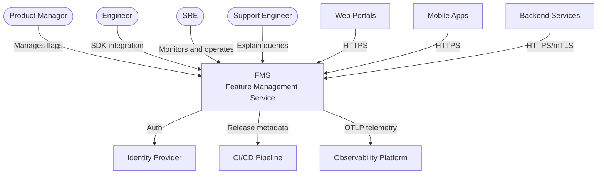
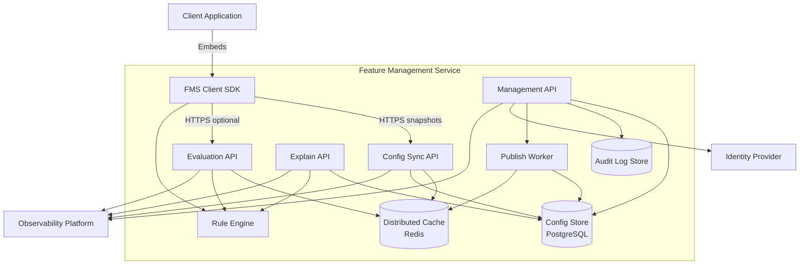
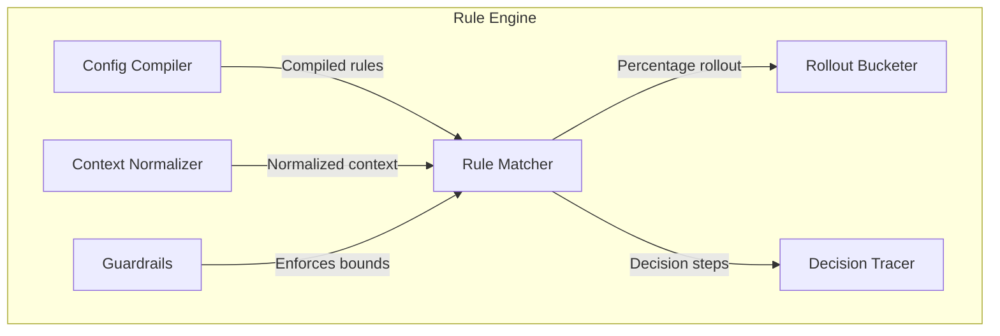
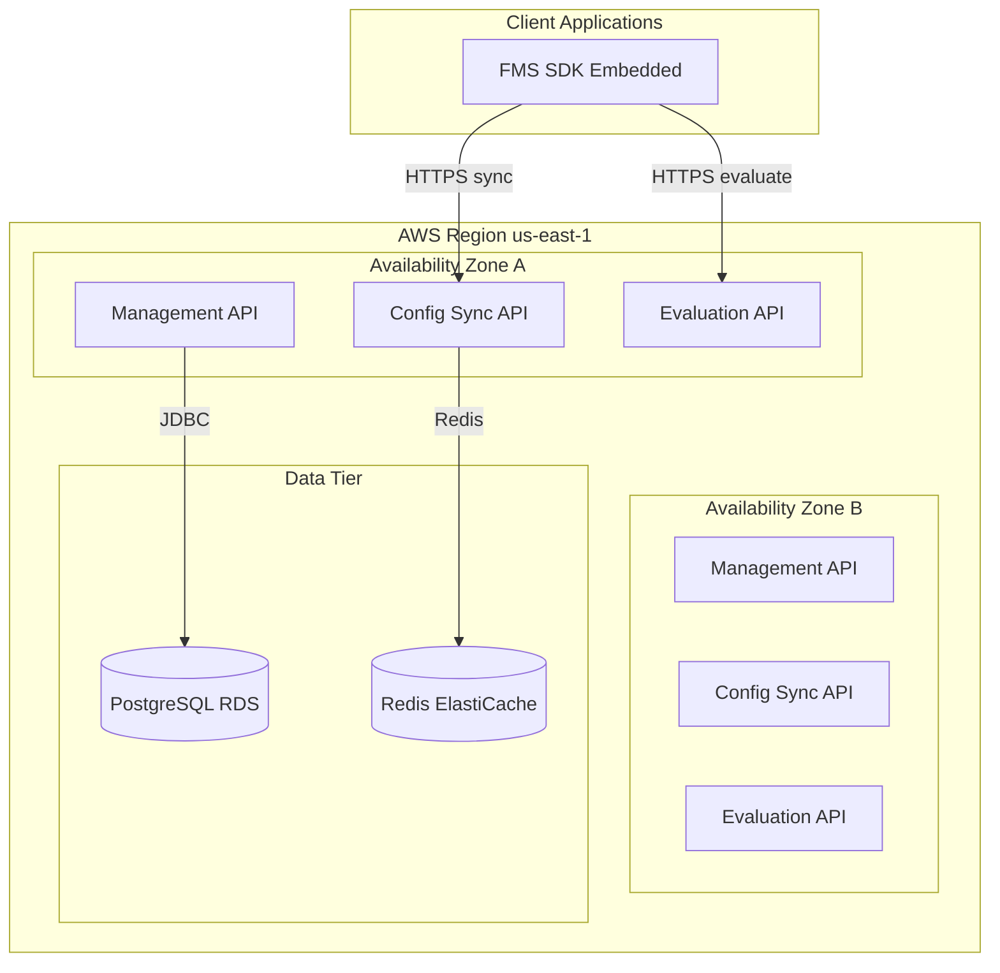
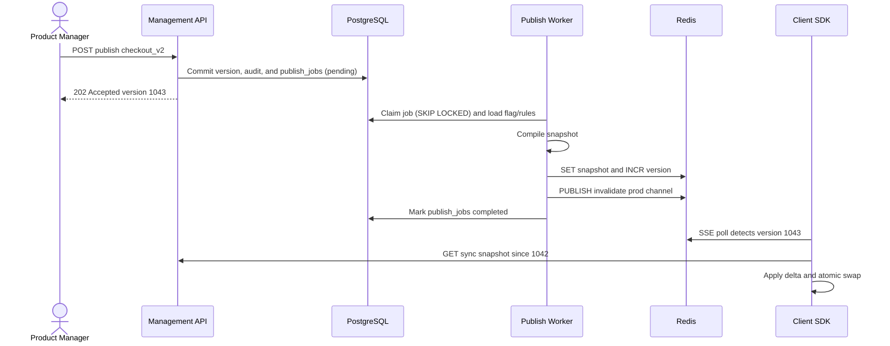
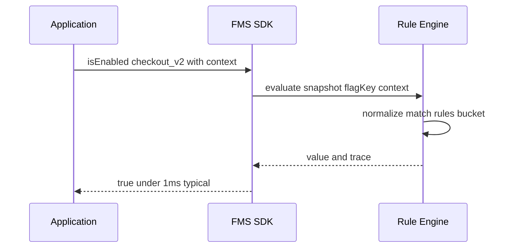
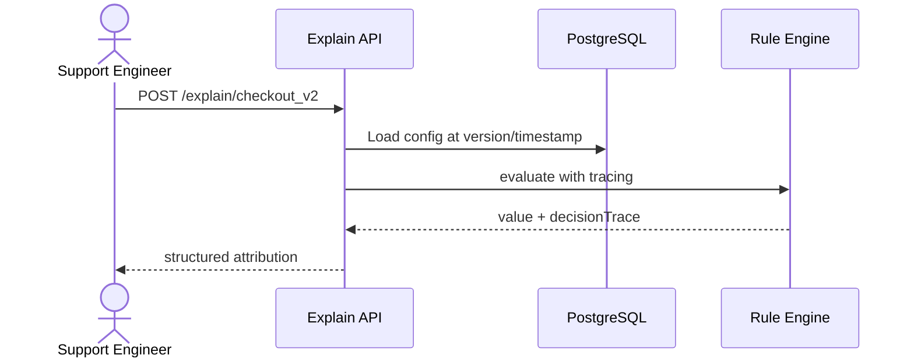

# Feature Management Service — Technical Architecture Document

| Attribute | Value |
|-----------|-------|
| **Document Version** | 1.1 |
| **Status** | Draft |
| **Created** | 2026-06-25 |
| **Related Documents** | [BRD](./Feature_Management_Service_BRD.md), [Database Schema](./Feature_Management_Service_Database_Schema.md), [Redis Cache Design](./Feature_Management_Service_Redis_Cache_Design.md), [Design Brief](./Align_Expert_Software_Engineer_R2_Quiz.md) |
| **Product Name** | Feature Management Service (FMS) |

---

## 1. Purpose and Scope

This document translates the [Business Requirements Document](./Feature_Management_Service_BRD.md) into a concrete technical architecture for the Feature Management Service (FMS). It defines system structure, component responsibilities, API contracts, caching and evaluation design, SDK architecture, observability, explainability, security, and deployment topology.

**In scope**: architecture for management, evaluation, explainability, SDKs, caching, and platform integrations.

**Out of scope**: admin console UI implementation, A/B analytics, and detailed implementation code.

---

## 2. Architecture Principles

| Principle | Rationale |
|-----------|-----------|
| **Evaluate locally, sync centrally** | Push evaluation to the SDK/edge; the control plane is not on the hot path for every flag check. |
| **Versioned, incremental config** | Avoid full-catalog broadcasts; propagate changes by monotonic version + delta. |
| **Subscribe, don't replicate** | Each client loads only flags for its `appId` and environment. |
| **Deterministic evaluation** | Same inputs (`flagKey`, context, config version) always yield the same output across runtimes. |
| **Explainability by design** | Rule engine records a decision trace, not just a boolean result. |
| **Fail open on read, fail closed on write** | Evaluation degrades to last-known snapshot; management writes require strong consistency. |
| **Separate control and data planes** | Management API and Evaluation/Sync API scale and fail independently. |

---

## 3. C4 — System Context (Level 1)



---

## 4. C4 — Container Diagram (Level 2)



### 4.1 Container Responsibilities

| Container | Responsibility |
|-----------|----------------|
| **Management API** | Flag CRUD, rule editing, environment promotion, release binding, RBAC, kill switch |
| **Config Sync API** | Serve full/incremental snapshots per `appId` + `environment`; **SSE** for version update streaming |
| **Evaluation API** | Stateless remote evaluation for clients without full snapshot or server-side-only integrations |
| **Explain API** | Return structured decision traces; support historical replay by `configVersion` |
| **Rule Engine** | Shared deterministic evaluator used by SDK, Evaluation API, and Explain API |
| **Publish Worker** | Poll `publish_jobs` Outbox → validate → compile snapshot → write cache → Redis Pub/Sub notify |
| **Config Store** | Relational source of truth with versioned rows |
| **Distributed Cache** | Low-latency snapshot delivery and version-indexed invalidation |

---

## 5. C4 — Component Diagram (Level 3)

### 5.1 Rule Engine (Shared Core)



**Evaluation order** (short-circuit):

1. Archived / disabled flag → return default `off`
2. Environment gate (flag not published in env)
3. Kill switch override (global or regional)
4. Rules sorted by `priority` ascending
5. First fully matching rule wins
6. Fallback to flag default value

**Stable percentage bucketing**:

```
bucket = murmur3(flagKey + userId + rolloutSalt) % 10000
enabled  = bucket < (rolloutPercent * 100)
```

Same algorithm and salt are implemented in all SDKs and server-side engine builds to guarantee cross-surface consistency.

---

## 6. Logical Architecture — Control vs Data Plane

```
┌─────────────────────────────────────────────────────────────────────────┐
│                           CONTROL PLANE                                  │
│  Admin Console / CI ──► Management API ──► PostgreSQL (source of truth) │
│                              │         (flag_versions + publish_jobs)      │
│                              ▼                                           │
│                       Publish Worker ──► Redis (compiled snapshots)      │
│                       (polls publish_jobs Outbox)                        │
└─────────────────────────────────────────────────────────────────────────┘
                               │ version bump / pub-sub
                               ▼
┌─────────────────────────────────────────────────────────────────────────┐
│                            DATA PLANE                                    │
│                                                                          │
│   Client SDK ◄──► Config Sync API ◄──► Redis                             │
│       │                                                                  │
│       ├──► Local in-memory snapshot (primary evaluation path)            │
│       ├──► Evaluation API (optional fallback / server-only)              │
│       └──► Explain API (debug / support tooling)                         │
└─────────────────────────────────────────────────────────────────────────┘
```

---

## 7. Caching Strategy

Caching is the primary mechanism for meeting throughput, latency, and cost objectives at 5,000+ flags and 100+ applications.

### 7.1 Three-Tier Cache Model

| Tier | Location | Contents | TTL / Invalidation | Target Hit Rate |
|------|----------|----------|-------------------|-----------------|
| **L1** | SDK in-process memory | Subscribed `appId` snapshot slice | Refreshed on version change | > 99.9% of evaluations |
| **L2** | Redis Cluster | Compiled snapshots keyed by `env:appId:version` | Overwritten on publish; old versions expire (e.g., 24h) | > 99% of sync requests |
| **L3** | PostgreSQL | Authoritative flag definitions | N/A (source of truth) | Sync/eval cache miss only |

### 7.2 Per-Application Subscription (Sublinear Growth)

Clients declare `appId` (and optional tag filters) at SDK init. The sync API returns only relevant flags:

```
GET /v1/sync/snapshot?environment=prod&appId=checkout-service&sinceVersion=1042
```

**Memory bound (per SDK instance)**:

```
memory ≈ baseSDK + (subscribedFlags × avgRuleSize)
```

With ~50–200 flags per app (not 5,000 global), mobile and edge memory stay bounded.

### 7.3 Incremental Sync

Each publish increments a global monotonic `configVersion` per `environment`.

| Sync Mode | When Used | Payload |
|-----------|-----------|---------|
| **Full snapshot** | Cold start, version gap too large, first connect | Complete subscribed flag set |
| **Incremental delta** | `sinceVersion` within retention window (e.g., last 100 versions) | Changed flags only + `deletedFlagKeys` |
| **Streaming (SSE)** | Long-lived connections (server SDK, web); sole streaming protocol | `version` events triggering delta fetch |

**Invalidation flow**:

```
1. Management API commits publish in one transaction:
   flag_version + audit_events + publish_jobs (status=pending)
2. Management API returns 202 Accepted (configVersion allocated)
3. Publish Worker claims job (FOR UPDATE SKIP LOCKED), compiles snapshot,
   writes Redis, sets currentVersion, marks job completed
4. Redis Pub/Sub channel: fms:invalidate:{env}
5. Sync API nodes / SDKs receive event → fetch delta if localVersion < currentVersion
```

Avoids O(apps × flags) broadcast storms.

### 7.4 Evaluation API Cache (L2)

Evaluation API nodes hold a local LRU of hot `(env, appId, version)` snapshot slices with short TTL (e.g., 30s) backed by Redis. Stateless pods scale horizontally; coherency is version-based, not time-based.

### 7.5 Cost Controls

| Control | Mechanism |
|---------|-----------|
| Cap snapshot size | Max rules per flag, max segment size, archived flags excluded |
| Delta retention window | Force full snapshot if client is too stale |
| Rate limits | Per `appId` API key quotas on sync and remote evaluate |
| Compression | gzip/brotli on snapshot payloads; compact binary format for mobile |

### 7.6 Async Publish — PostgreSQL Outbox

Publish is decoupled from the Management API request thread without a message broker. The **Transactional Outbox** pattern ensures the publish job is never lost if the API commit succeeds.

| Aspect | Design |
|--------|--------|
| **Write path** | Single PostgreSQL transaction: `flag_versions` + `audit_events` + `publish_jobs` (`status=pending`) |
| **API response** | `202 Accepted` with `configVersion` immediately after commit |
| **Consumption** | Publish Worker polls `publish_jobs` with `FOR UPDATE SKIP LOCKED` |
| **Idempotency** | Worker checks `config_version` before writing Redis; safe to retry |
| **Retry** | Exponential backoff via `next_retry_at`; `max_attempts` (default 5) then `failed` |
| **Scaling** | Multiple Worker replicas compete for jobs; HPA on `fms_publish_jobs_backlog` |
| **Notification** | After job completes, Worker `PUBLISH`es to Redis `fms:pubsub:{env}` (best-effort signal) |

**Why not Redis Pub/Sub for the job queue?** Pub/Sub is fire-and-forget with no persistence or single-consumer semantics. It remains the right tool for *invalidation broadcast* after the Outbox job completes.

See [Technology Stack](./Feature_Management_Service_Technology_Stack.md) §4.4 for table schema and implementation notes.

---

## 8. API Design

Base URL pattern: `https://fms.{env}.example.com/api`

All APIs use JSON, `application/json`, ISO-8601 timestamps, and correlation via `X-Request-Id` / W3C `traceparent`.

### 8.1 Management API (`/v1/management`)

**Authentication**: OAuth2 Bearer (OIDC) + RBAC scopes.

| Method | Path | Description |
|--------|------|-------------|
| `POST` | `/flags` | Create flag |
| `GET` | `/flags` | List flags (filter: `appId`, `tag`, `status`, pagination) |
| `GET` | `/flags/{flagKey}` | Get flag with rules |
| `PUT` | `/flags/{flagKey}` | Update metadata |
| `PUT` | `/flags/{flagKey}/rules` | Replace rule set |
| `POST` | `/flags/{flagKey}/publish` | Publish to environment |
| `POST` | `/flags/{flagKey}/rollback` | Rollback to prior version |
| `POST` | `/environments/{env}/promote` | Promote config from staging → prod |
| `POST` | `/releases` | Create/link release record |
| `GET` | `/audit` | Query audit events |

**Publish request example**:

```json
{
  "environment": "prod",
  "releaseId": "REL-2026-06-25-checkout",
  "comment": "Enable checkout_v2 at 5% NA",
  "killSwitch": false
}
```

**Publish response**:

```json
{
  "flagKey": "checkout_v2",
  "environment": "prod",
  "configVersion": 1043,
  "publishedAt": "2026-06-25T10:00:00Z",
  "publishedBy": "user@example.com"
}
```

### 8.2 Config Sync API (`/v1/sync`)

**Authentication**: API key or mTLS service identity.

**Streaming**: version updates use **SSE only** (`GET /stream`). Clients that cannot hold a long-lived connection use `HEAD /version` or `GET /snapshot` on a schedule (not a separate streaming protocol).

| Method | Path | Description |
|--------|------|-------------|
| `GET` | `/snapshot` | Full or incremental snapshot |
| `GET` | `/stream` | SSE stream of version updates |
| `HEAD` | `/version` | Lightweight version check |

**Snapshot query parameters**: `environment`, `appId`, `sinceVersion` (optional)

**Snapshot response**:

```json
{
  "environment": "prod",
  "appId": "checkout-service",
  "configVersion": 1043,
  "previousVersion": 1042,
  "syncType": "delta",
  "flags": [
    {
      "key": "checkout_v2",
      "type": "boolean",
      "defaultValue": false,
      "rules": [
        {
          "id": "rule-na-5pct",
          "priority": 10,
          "conditions": { "region": ["US", "CA"], "rolloutPercent": 5 },
          "value": true
        }
      ],
      "releaseId": "REL-2026-06-25-checkout",
      "rolloutSalt": "a1b2c3..."
    }
  ],
  "deletedFlagKeys": []
}
```

### 8.3 Evaluation API (`/v1/evaluate`)

**Authentication**: API key or mTLS.

| Method | Path | Description |
|--------|------|-------------|
| `POST` | `/flags/{flagKey}` | Single evaluation |
| `POST` | `/batch` | Batch evaluation |

**Request**:

```json
{
  "environment": "prod",
  "appId": "checkout-service",
  "context": {
    "userId": "usr_123",
    "region": "US",
    "appVersion": "3.2.1",
    "customAttributes": { "loyaltyTier": "gold" }
  }
}
```

**Response**:

```json
{
  "flagKey": "checkout_v2",
  "value": true,
  "enabled": true,
  "configVersion": 1043,
  "evaluationMode": "remote",
  "latencyMs": 4
}
```

### 8.4 Explain API (`/v1/explain`)

**Authentication**: API key with `explain:read` scope (support tooling).

| Method | Path | Description |
|--------|------|-------------|
| `POST` | `/flags/{flagKey}` | Explain current evaluation |
| `POST` | `/flags/{flagKey}/replay` | Point-in-time replay |

**Explain response**:

```json
{
  "flagKey": "checkout_v2",
  "enabled": true,
  "value": true,
  "configVersion": 1043,
  "release": {
    "releaseId": "REL-2026-06-25-checkout",
    "version": "3.2.0"
  },
  "context": {
    "userId": "usr_123",
    "region": "US"
  },
  "decisionTrace": [
    { "step": "environment_check", "result": "pass", "detail": "published in prod" },
    { "step": "rule_evaluation", "ruleId": "rule-na-5pct", "result": "match",
      "detail": "region US in [US, CA]; bucket 234 < 500 (5%)" }
  ],
  "matchedRuleId": "rule-na-5pct",
  "reasonCode": "RULE_MATCH"
}
```

**Reason codes** (stable enum): `RULE_MATCH`, `DEFAULT_VALUE`, `KILL_SWITCH`, `NOT_PUBLISHED`, `ARCHIVED`, `NO_MATCH`.

### 8.5 Supporting APIs

| API | Purpose |
|-----|---------|
| `GET /health` | Liveness |
| `GET /ready` | Readiness (DB + Redis connectivity) |
| `GET /v1/openapi.json` | OpenAPI 3.1 spec |

---

## 9. Client SDK Architecture

### 9.1 Design Goals

- **One evaluation spec, many runtimes** — shared semantics via a language-neutral spec and conformance tests.
- **Local-first** — default path never blocks on network during `isEnabled()`.
- **Thin platform wrappers** — shared core (Rust or WASM) with idiomatic bindings.

### 9.2 SDK Structure

```
fms-sdk-core/          # Shared: parser, engine, bucketing, trace
├── fms-sdk-java/
├── fms-sdk-go/
├── fms-sdk-node/
├── fms-sdk-web/       # TypeScript; WASM or pure TS engine
└── fms-sdk-mobile/    # Kotlin + Swift wrappers over shared core
```

### 9.3 SDK Lifecycle

```
initialize(apiKey, appId, environment, options)
    │
    ├─► fetch snapshot (blocking or async based on options)
    ├─► start background sync (poll interval / SSE)
    └─► expose: isEnabled(), getValue(), evaluate(), explain()

on configVersion change:
    ├─► apply delta to local store (atomic swap)
    └─► emit metric: fms_sdk_config_version

on sync failure:
    ├─► retain last good snapshot
    ├─► set degraded=true
    └─► emit metric: fms_sdk_degraded
```

### 9.4 Unified Context Model

| Field | Required | Used For |
|-------|----------|----------|
| `userId` | Recommended | Percentage bucketing, user targeting |
| `deviceId` | Mobile fallback | Anonymous stable bucketing |
| `region` | Recommended | Regional rules, kill switch |
| `appVersion` | Optional | Version gating |
| `appId` | Set at init | Subscription scope |
| `customAttributes` | Optional | Segment rules |

**Cross-surface consistency contract**: Web and mobile must pass the same `userId` when available. Bucketing uses `userId` → else `deviceId` → else evaluation returns default with `reasonCode: INCOMPLETE_CONTEXT`.

### 9.5 Integration Patterns

| Client Type | Recommended Pattern |
|-------------|---------------------|
| **Backend service** | Server SDK with SSE sync; local evaluation on request path |
| **Web portal** | JS SDK; bootstrap snapshot inline or edge-cached; SSE for updates |
| **Mobile** | Mobile SDK; startup sync + periodic background refresh; tolerate offline with staleness cap (configurable, e.g., 15 min) |

---

## 10. Explainability Model

Explainability is implemented inside the **Rule Engine Decision Tracer**, not as a post-hoc guess.

### 10.1 Trace Model

Each evaluation produces a `DecisionTrace`:

| Field | Description |
|-------|-------------|
| `configVersion` | Config used |
| `release` | Linked release metadata |
| `matchedRuleId` | Winning rule, if any |
| `reasonCode` | Summary enum |
| `steps[]` | Ordered evaluation steps with pass/fail and human-readable detail |
| `bucket` | Percentage bucket value (for rollout rules) |

### 10.2 Modes

| Mode | Where | Use Case |
|------|-------|----------|
| **Local explain** | SDK `explain()` | Developer debugging |
| **Remote explain** | Explain API | Support tickets, audit |
| **Replay explain** | Explain API + `configVersion` or `timestamp` | Historical investigation |

### 10.3 Privacy

Explain output redacts full `customAttributes` unless caller has elevated scope. Logs never contain raw PII — only hashed `userId` prefix for correlation.

---

## 11. Data Model

### 11.1 Core Tables (PostgreSQL)

```sql
-- Simplified logical schema

applications (id, name, api_key_hash, created_at)

feature_flags (
  id, key, app_id, name, type, default_value,
  status,  -- draft | published | archived
  created_at, updated_at
)

flag_rules (
  id, flag_id, environment, priority,
  conditions_json,  -- region, segments, rollout%, appVersion, etc.
  value_json,
  created_at
)

flag_versions (
  id, flag_id, environment, version,
  snapshot_json, release_id, published_by, published_at
)

releases (
  id, release_id, version, description, created_at
)

audit_events (
  id, actor, action, resource_type, resource_id,
  diff_json, timestamp
)

environment_config (
  environment, current_version, updated_at
)

publish_jobs (
  id, flag_key, environment, config_version,
  payload_json, status,  -- pending | processing | completed | failed
  attempt_count, max_attempts, locked_by, locked_at,
  next_retry_at, error_message, created_at, completed_at
)
```

### 11.2 Redis Keys

See [Redis Cache Design](./Feature_Management_Service_Redis_Cache_Design.md) for the full key namespace, value formats, TTL policies, and read/write paths.

| Key Pattern | Value |
|-------------|-------|
| `{fms:{env}:{appId}}:snap:current` | Pointer to current version |
| `{fms:{env}:{appId}}:snap:v{version}` | Compiled snapshot blob (gzip JSON) |
| `{fms:{env}:{appId}}:delta:{from}:{to}` | Precomputed delta (optional) |
| `{fms:{env}}:env:version` | Environment-wide current version |
| `fms:pubsub:{env}` | Invalidation Pub/Sub channel |

---

## 12. Observability Strategy

### 12.1 Telemetry Stack

| Signal | Standard | Notes |
|--------|----------|-------|
| **Metrics** | OpenTelemetry → Prometheus | RED metrics per API |
| **Traces** | OpenTelemetry → Jaeger/Tempo | End-to-end publish and evaluate flows |
| **Logs** | Structured JSON → centralized log store | Correlation ID on every request |
| **Alerts** | Grafana / PagerDuty | SLO-based |

### 12.2 Key Metrics

**Service-level**:

| Metric | Type | Alert Threshold |
|--------|------|-----------------|
| `fms_eval_requests_total` | Counter | — |
| `fms_eval_latency_seconds` | Histogram | P99 > 20ms (remote) |
| `fms_sync_requests_total` | Counter | — |
| `fms_config_version_lag_seconds` | Gauge | P95 > 60s |
| `fms_cache_hit_ratio` | Gauge | < 95% (L2) |
| `fms_publish_duration_seconds` | Histogram | P95 > 5s |
| `fms_publish_jobs_backlog` | Gauge | pending + failed jobs > threshold |
| `fms_errors_total` | Counter | Error rate > 0.1% |

**SDK-level** (client-reported):

| Metric | Purpose |
|--------|---------|
| `fms_sdk_degraded` | Tracks fallback to stale snapshot |
| `fms_sdk_config_version` | Detects propagation lag per app |
| `fms_sdk_init_failures_total` | Onboarding health |

### 12.3 Dashboards

1. **Service Health** — availability, error rate, latency, pod count
2. **Config Propagation** — version lag by `appId`, publish throughput
3. **Flag Hotspots** — top flags by evaluation volume
4. **Incidents** — kill switch activations, degraded SDK instances

### 12.4 Distributed Tracing Flows

**Publish flow**: `Management API → PostgreSQL (Outbox) → Publish Worker → Redis → Pub/Sub`

**Evaluate flow (remote)**: `Client → Evaluation API → Redis → Rule Engine`

All spans share `traceId`; `flagKey`, `appId`, `configVersion` attached as attributes (not PII).

---

## 13. Security Architecture

| Layer | Control |
|-------|---------|
| **Transport** | TLS 1.2+ everywhere |
| **Management auth** | OIDC; RBAC roles: `viewer`, `editor`, `publisher`, `admin`, `kill_switch` |
| **Data plane auth** | Per-app API keys rotated via secrets manager; mTLS for service-to-service |
| **Secrets** | No hardcoded keys; vault/env injection only |
| **Data at rest** | PostgreSQL and Redis encryption; sensitive rule payloads encrypted at application level if needed |
| **Audit** | Append-only audit log for all publish, rollback, kill switch actions |
| **Input validation** | Strict JSON schema; allowlisted condition operators; max payload sizes |
| **Error responses** | Generic messages to clients; details logged server-side only |

---

## 14. Deployment Architecture

### 14.1 C4 Deployment Diagram



### 14.2 Scaling Characteristics

| Component | Scaling Model | Notes |
|-----------|---------------|-------|
| Management API | Low QPS; 2–4 replicas | CPU light; DB write bound on publish |
| Config Sync API | HPA on CPU/connections | Long-lived SSE connections drive sizing |
| Evaluation API | HPA on RPS | Stateless; primary remote eval path |
| Explain API | Moderate replicas | Support traffic; not on hot path |
| Publish Worker | Horizontal via Outbox polling | `publish_jobs` row per publish; `FOR UPDATE SKIP LOCKED` |
| Redis | Cluster mode | Shard by `env:appId` hash |
| PostgreSQL | Vertical + read replicas | Read replicas for explain/history queries |

### 14.3 Multi-Region (Phase 2)

- **Management writes**: single primary region (recommended initially) to avoid conflict resolution complexity.
- **Read replicas / Redis replicas** in secondary regions for sync and eval.
- **SDK fallback**: local snapshot tolerates regional control-plane partition.

---

## 15. Dynamic View — Key Flows

### 15.1 Publish and Propagate



### 15.2 Local Evaluation (Hot Path)



### 15.3 Support Investigation



---

## 16. Technology Recommendations

| Concern | Recommended Option | Alternatives |
|---------|-------------------|--------------|
| Management / Sync / Eval services | Go or Java (Spring Boot) | Node.js for lower scale |
| Rule engine core | Rust (shared via FFI/WASM) | Pure Go/Java with conformance tests |
| Primary store | PostgreSQL 15+ | — |
| Cache | Redis Cluster 7+ | KeyDB, Valkey |
| Async publish | PostgreSQL Outbox (`publish_jobs`) + Worker polling | — |
| API gateway | Existing platform ingress + rate limiting | Kong, Envoy |
| Identity | Corporate OIDC (Okta, Azure AD) | — |
| Observability | OpenTelemetry Collector → Prometheus + Tempo + Loki | Datadog, cloud-native stacks |
| Deployment | Kubernetes (EKS) | ECS |

Final stack selection should follow organizational standards; the architecture is portable across these choices.

---

## 17. Non-Functional Design Mapping

| BRD NFR | Architectural Answer |
|---------|---------------------|
| NFR-01 ≥ 100k eval/s | SDK local eval handles bulk; Evaluation API scales horizontally |
| NFR-04 sublinear memory | Per-app subscription + delta sync |
| NFR-10 99.95% availability | Multi-AZ, SDK degradation, no single point on eval path |
| NFR-12 storage outage | SDK continues on last snapshot; sync retries with backoff |
| NFR-20 auth split | OIDC (mgmt) vs API key/mTLS (data plane) |

---

## 18. Failure Modes and Degradation

| Failure | Behavior |
|---------|----------|
| Redis unavailable | Sync/Eval API read from PostgreSQL (slower); SDK uses local snapshot |
| PostgreSQL unavailable | Management writes fail; eval continues on cached snapshots |
| Sync API down | SDK serves stale snapshot; metric `fms_sdk_degraded=1` |
| Publish worker stuck | Alert on `config_version_lag` and `fms_publish_jobs_backlog`; retry via `next_retry_at` or manual re-queue failed jobs |
| Incomplete context | Return default value; `reasonCode: INCOMPLETE_CONTEXT` in explain |

---

## 19. Implementation Phases (Aligned with BRD)

| Phase | Architecture Deliverables |
|-------|---------------------------|
| **M1** | PostgreSQL schema, Management API, basic Rule Engine, Evaluation API, Java/Go SDK |
| **M2** | Redis snapshot layer, Config Sync API, delta sync, SSE, observability baseline |
| **M3** | Explain API, release binding, audit store, RBAC, kill switch fast path |
| **M4** | Web/mobile SDKs, multi-AZ, load test sign-off, SLO dashboards |

---

## 20. Open Technical Decisions

| # | Decision | Options | Recommendation |
|---|----------|---------|----------------|
| 1 | Shared engine packaging | Rust core vs duplicated logic | Rust core + conformance test suite |
| 2 | Delta precomputation | On-publish vs on-demand | On-publish for last N versions |
| 3 | Segment storage | Inline JSON vs external segment service | Inline for MVP; external for large cohorts |
| 4 | Mobile offline staleness | 5 / 15 / 60 min cap | 15 min default, configurable per app |

---

## 21. References

- [Feature Management Service BRD](./Feature_Management_Service_BRD.md)
- [Feature Management Service Technology Stack](./Feature_Management_Service_Technology_Stack.md)
- [Align Expert Software Engineer R2 Quiz](./Align_Expert_Software_Engineer_R2_Quiz.md)
- [C4 Model](https://c4model.com/)
- [OpenTelemetry Specification](https://opentelemetry.io/docs/specs/otel/)
- [OpenAPI 3.1](https://spec.openapis.org/oas/v3.1.0)

---

*This document is the technical counterpart to the BRD. API contracts and schemas should be maintained in the repository `openapi/` directory as the implementation evolves.*
