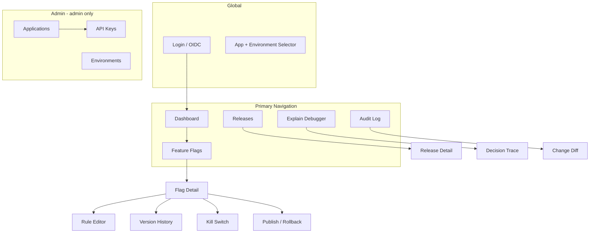
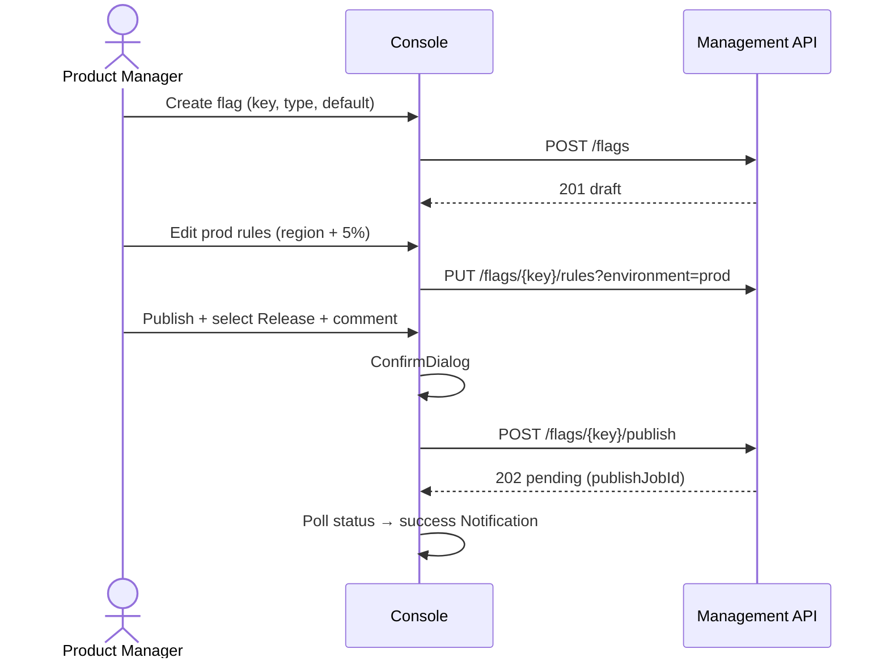
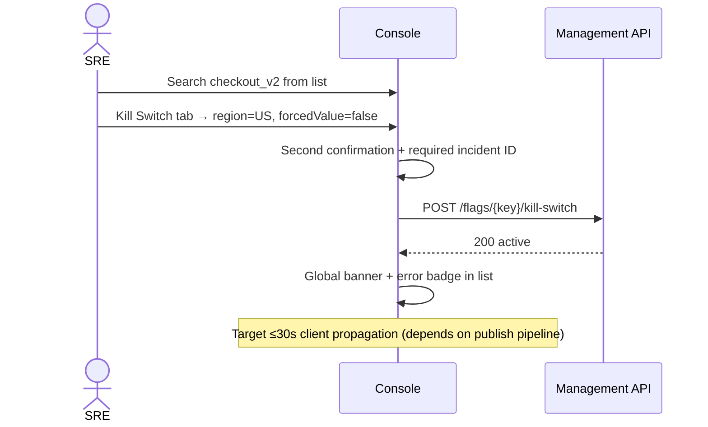
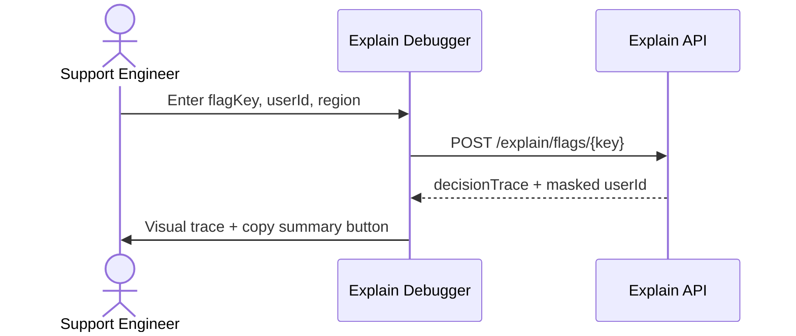

# Feature Management Service — UI Design Document

| Attribute | Value |
|-----------|-------|
| **Document Version** | 1.0 |
| **Status** | Draft |
| **Created** | 2026-06-29 |
| **Related Documents** | [BRD](./Feature_Management_Service_BRD.md) · [API Design](./Feature_Management_Service_API_Design.md) · [Technical Architecture](./Feature_Management_Service_Technical_Architecture.md) · [Technology Stack](./Feature_Management_Service_Technology_Stack.md) · [Database Schema](./Feature_Management_Service_Database_Schema.md) |
| **Product Name** | Feature Management Service (FMS) — Admin Console |
| **Technology** | Vaadin 25.1.7 (Java Flow, server-side UI, **Aura theme**) |

---

## 1. Purpose and Scope

This document defines the user interface design for the FMS **Admin Console**, covering information architecture, functional design, visual style, interaction patterns, and implementation constraints. The console is the primary human interface to the control plane, serving product managers, engineers, SREs, and support staff who manage the full feature-flag lifecycle via the Management API.

**In scope**:

- Admin console UI/UX design (Vaadin Flow)
- Page-to-API mapping for Management API and Explain API
- RBAC-driven visibility and action permissions
- MVP and phased delivery roadmap

**Out of scope**:

- Client SDK integration UI
- Direct exposure of data-plane APIs (Sync / Evaluate) — used only indirectly via debugging tools
- Full A/B experiment analytics platform

---

## 2. Design Principles

| Principle | Description |
|-----------|-------------|
| **Security first** | Destructive actions (publish, kill switch, rollback) require confirmation; insufficient permissions hide or disable controls rather than surfacing errors only |
| **Context-aware** | Global context bar always shows current `appId` + `environment`; all lists and editors operate within that scope |
| **Explainability visible** | Rule editor and Explain tool share a unified decision-trace visualization to reduce cognitive load for “why is this enabled for this user?” |
| **Draft vs publish separation** | Clearly distinguish `draft` / `published` / `archived` and `draftDirty` states to prevent accidental changes |
| **High information density** | Engineer- and ops-oriented; favor data grids and Master-Detail layouts with keyboard navigation and batch actions |
| **Async operation feedback** | Publish, promote, and kill-switch operations (`202 Accepted`) show job status and progress instead of blocking the page |
| **Enterprise consistency** | Follow enterprise security baseline: no plaintext API keys, PII masked by default, no internal paths in user-facing errors |

---

## 3. User Roles and Core Scenarios

| Role | Typical Tasks | Related User Story |
|------|---------------|-------------------|
| **Product Manager (PM)** | Create flags, configure region/percentage rollout, link releases | US-02 |
| **Software Engineer** | Create/edit flags and rules, environment promotion, version history | US-03 |
| **SRE / Operations** | Kill switch, rollback, audit and publish status | US-01 |
| **Support** | Explain queries: why a user sees or does not see a feature | US-04 |
| **Platform Admin** | Application onboarding, API key management, environment config | FR-20 ~ FR-23 |
| **Read-only Viewer** | Browse flag list and audit log | `viewer` role |

---

## 4. Information Architecture

### 4.1 Site Map



### 4.2 Route Plan

| Route | Page | Minimum Permission |
|-------|------|-------------------|
| `/login` | OIDC login | Anonymous |
| `/` | Dashboard | `flags:read` |
| `/flags` | Flag list | `flags:read` |
| `/flags/:flagKey` | Flag detail (Master-Detail) | `flags:read` |
| `/flags/:flagKey/rules` | Rule editor | `flags:write` |
| `/flags/:flagKey/versions` | Version history and diff | `flags:read` |
| `/releases` | Release list | `flags:read` |
| `/releases/:releaseId` | Release detail | `flags:read` |
| `/explain` | Explain debugger | `explain:read` (API key or console proxy) |
| `/audit` | Audit log | `audit:read` |
| `/admin/applications` | Application management | `admin` |
| `/admin/applications/:appId/keys` | API key management | `admin` |
| `/admin/environments` | Environment configuration | `admin` / `flags:read` |

### 4.3 Global Layout Structure

```
┌──────────────────────────────────────────────────────────────────────────┐
│  [Logo] FMS          [App: checkout-service ▼]  [Env: prod ▼]    [User ▼] │
├────────────┬─────────────────────────────────────────────────────────────┤
│  Dashboard  │  Breadcrumb: Flags / checkout_v2                           │
│  Flags      │  ┌─────────────────────────────────────────────────────────┐ │
│  Releases   │  │                                                         │ │
│  Explain    │  │              Main content (Master-Detail / Form)        │ │
│  Audit Log  │  │                                                         │ │
│  ───────    │  └─────────────────────────────────────────────────────────┘ │
│  Apps*      │  [Optional] Right drawer: publish confirm / kill switch / diff │
│  Envs*      │                                                             │
└────────────┴─────────────────────────────────────────────────────────────┘
  * admin only
```

**Layout components (Vaadin)**: `AppLayout` + `SideNav` + `Drawer` (collapsible sidebar on mobile)

---

## 5. Visual Design Specification

### 5.1 Design Positioning

The FMS admin console is an **internal enterprise operations and release tool**. The style should be professional, restrained, and information-dense — comparable to LaunchDarkly or Unleash — while aligning with corporate design standards.

| Dimension | Guideline |
|-----------|-----------|
| **Tone** | Professional, trustworthy, efficient; avoid consumer-style flashy animations |
| **Information density** | Lower `--aura-base-size` (e.g. `16`) for a compact layout; moderate grid row height to show more flags per screen |
| **Color semantics** | Consistent status colors: success/published, warning/draft dirty, error/kill switch, info/in progress |

### 5.2 Theme — Aura (mandatory)

Per the [Technology Stack](./Feature_Management_Service_Technology_Stack.md), the admin console uses **Vaadin 25.1.7** with the **Aura theme only**. Lumo and other Vaadin themes are out of scope.

Load Aura on the application shell:

```java
@StyleSheet(Aura.STYLESHEET)
@StyleSheet("styles.css")
public class Application implements AppShellConfigurator { }
```

**Brand customization** uses `--aura-*` and shared `--vaadin-*` base properties only. Do not reference `--lumo-*` variables.

```css
/* Brand accent — enterprise blue (example) */
html {
  --aura-accent-color-light: hsl(214, 90%, 48%);
  --aura-accent-color-dark: hsl(214, 80%, 65%);
  color-scheme: light dark; /* follow OS preference */
}
```

### 5.3 Design Tokens

#### Color Semantics

| Semantic | Usage | Aura Token / Class | Example |
|----------|-------|-------------------|---------|
| Accent (primary) | Primary buttons, links, selected state | `--aura-accent-color` | Publish, Save draft |
| Success | Published, match success | `aura-accent-green` / `--aura-green` | Badge `published` |
| Warning | Unpublished draft, pending confirm | `aura-accent-orange` / `--aura-orange` | Badge `draftDirty` |
| Error | Kill switch active, validation failure | `aura-accent-red` / `--aura-red` | Kill switch banner |
| Secondary text | Descriptions, timestamps | `--vaadin-text-color-secondary` | List subtitles |
| Divider | Section boundaries | `--vaadin-border-color-secondary` | Card borders |
| Elevated surface | Cards, panels, input fields | `aura-surface` + `--aura-surface-level` | Dashboard KPI cards |

#### Typography

| Level | Size Token | Usage |
|-------|------------|-------|
| Page title | `--aura-font-size-xl` | Page H1 |
| Section title | `--aura-font-size-l` | Card/panel titles |
| Body | `--aura-font-size-m` | Forms, tables |
| Auxiliary | `--aura-font-size-s` | Help text, badges |
| Micro | `--aura-font-size-xs` | Version numbers, configVersion |

Base size defaults to `14`; adjust `--aura-base-font-size` if needed.

#### Spacing, Radius, and Shadows

- UI density: `--aura-base-size` (recommended `16` for FMS; range 12–24)
- Gap and padding: derived from `--vaadin-gap`, `--vaadin-padding` (computed from base size)
- Corner radius: `--aura-base-radius` (or override `--vaadin-radius-m` / `--vaadin-radius-l`)
- Dialog / overlay shadow: `--aura-shadow-m`
- Card elevation: `aura-surface` class with `--aura-surface-level: 1`

### 5.4 Icons

Use **Vaadin Icons** (`vaadin-icons`):

| Function | Icon |
|----------|------|
| Feature flag | `flag` |
| Publish | `upload` |
| Rollback | `undo` |
| Kill switch | `ban` / `warning` |
| Explain | `search` / `info-circle` |
| Audit | `list` |
| Environment | `layers` |
| API key | `key` |

### 5.5 Status Badge Specification

| Status | Color Theme | Label |
|--------|-------------|-------|
| `draft` | Neutral/gray | Draft |
| `published` | success | Published |
| `archived` | contrast-50% | Archived |
| `draftDirty` | warning | Unpublished changes |
| Kill switch active | error | Kill switch active |
| Publish job `pending` | primary | Publishing… |
| Publish job `completed` | success | Live |
| Publish job `failed` | error | Publish failed |

### 5.6 Dark Mode

Aura uses CSS `color-scheme` for light/dark switching. Support **system preference + manual toggle** via `ColorScheme.LIGHT_DARK` or `Page.setColorScheme()`.

Optional split scheme for App Layout: dark navigation drawer + light/dark content area following OS preference:

```css
html {
  color-scheme: dark;
  --aura-content-color-scheme: light dark;
}
```

In dark mode, kill switch banners and error states maintain high contrast; do not rely on a thin red line alone.

---

## 6. Functional Module Design

### 6.1 Login and Authentication

**Flow**: Corporate OIDC → Spring Security → JWT role resolution → console session.

| Element | Design |
|---------|--------|
| Login page | Vaadin `LoginOverlay` or redirect to IdP |
| Session timeout | Prompt after 30 minutes idle; optional re-auth before sensitive actions (P2) |
| User menu | Email/name, current role badge, sign out |
| No permission | Dedicated 403 page: required scope, contact admin |

### 6.2 Dashboard (`/`)

**Goal**: One-screen overview of flag health and recent activity for the current app + environment.

| Area | Content |
|------|---------|
| KPI card row | Total flags / published / draft / active kill switches |
| Quick actions | New flag, Explain query, view audit (permission-gated) |
| Recent changes | Last 10 audit events (actor, action, resource, time) |
| Pending items | `draftDirty` flags (linked to detail) |
| Environment info | Current `configVersion`, last publish time |

**Vaadin components**: `Dashboard` (optional), `Card`, `Grid` (compact mode)

### 6.3 Feature Flag List (`/flags`)

**Goal**: Efficient search and management at 5,000+ flag scale.

#### Filters and Search Bar

| Control | Binding |
|---------|---------|
| Search box | `search` (fuzzy match on name/key) |
| Status filter | `status`: draft / published / archived |
| Tag filter | `tag` multi-select Combo Box |
| Type filter | boolean / string / number / json |

#### Grid Columns

| Column | Description |
|--------|-------------|
| Key | Monospace font; click to open detail |
| Name | Primary title |
| Type | Badge |
| Status | Status badge + `draftDirty` indicator |
| Default value | Formatted by type |
| Tags | Chip list (max 3 + “+N”) |
| Last updated | Relative time + absolute time tooltip |
| Actions | Context menu: edit / publish / kill switch (permission-gated) |

#### Batch Actions (P1)

- Multi-select → bulk archive, bulk promote to environment (requires `flags:publish`)

**Vaadin components**: `Grid` + `GridFilterColumn`, cursor pagination (`limit` + `cursor`)

### 6.4 Flag Detail (`/flags/:flagKey`)

Uses **Master-Detail Layout**: metadata and tabs on the left, main editor on the right.

#### Page Header

```
checkout_v2                    [Unpublished changes]  [Kill switch active]
Checkout V2 Flow
checkout-service · boolean · default: false
─────────────────────────────────────────────────────────────
[Rules] [Version History] [Publish] [Kill Switch] [Linked Release]
```

#### Tab: Overview

| Field | Editable | Validation |
|-------|----------|------------|
| Key | Read-only after create | — |
| Name | ✓ | Required, ≤128 chars |
| Description | ✓ | Markdown summary |
| Type | Read-only after create | boolean/string/number/json |
| Default value | ✓ (draft state) | Must match type |
| Tags | ✓ | Comma-separated or tag input |
| Archive | Button | ConfirmDialog |

#### Tab: Rules (core)

**Environment tab bar**: `dev` | `staging` | `prod` (synced with global environment selector; overridable)

**Rule list** (drag-to-reorder = priority):

| Column | Description |
|--------|-------------|
| Priority | Number; batch save after drag |
| Rule name | Text |
| Condition summary | Human-readable: `region ∈ [US,CA] · 5% rollout` |
| Return value | Displayed by flag type |
| Enabled | Toggle |
| Actions | Edit / delete |

**Rule edit drawer/dialog**:

```
Rule name:  [NA 5% rollout        ]
Priority:   [10]

Condition builder:
  ┌─ region ──────── [in ▼] ── [US] [CA] [+]
  ├─ rolloutPercent ─────────── [5] %
  ├─ userId ──────── [equals ▼] ── (optional)
  ├─ appVersion ──── [gte ▼] ──── 3.2.0
  └─ [+ Add condition]

Return value: (●) true  ( ) false     [for boolean]
Enabled:      [✓]

[Cancel]  [Save]
```

**Condition operators** (aligned with API §11): `in`, `not_in`, `equals`, `not_equals`, `gte`, `lte`, `contains`

**Validation feedback**:

- `rolloutPercent` 0–100
- Max 50 rules per flag per environment
- Priority must be unique

**Vaadin components**: `Details` for advanced conditions, `ComboBox`, `MultiSelectComboBox`, `IntegerField`

#### Tab: Version History

| Column | Description |
|--------|-------------|
| flagVersion | Version number |
| configVersion | Environment config version |
| Published at | |
| Published by | |
| Release | Link |
| Actions | View snapshot / diff against current / rollback to this version |

**Diff view**: Side-by-side JSON or structured field comparison (`rules`, `defaultValue` highlighted)

#### Tab: Publish

| Element | Description |
|---------|-------------|
| Environment | Defaults to global environment |
| Release link | Combo Box search by `releaseId` |
| Comment | Required (for audit) |
| Publish preview | Summary of rules that will take effect |
| Primary action | “Publish to prod” → ConfirmDialog |
| Progress | Poll `publishJobId` until `completed` / `failed` |

#### Tab: Kill Switch

> Requires `flags:kill` permission; when active, show a persistent error-color banner at the top of the page.

| Field | Description |
|-------|-------------|
| Scope | `global` / `region` |
| Region code | Required when scope=region |
| Forced value | Usually `false` (off) |
| Reason | Required; link to incident ticket |
| Activate / deactivate | Primary button with error theme + second confirmation |

### 6.5 Environment Promotion (entry from `/flags` or environment page)

**Scenario**: After staging validation, batch promote to prod.

```
Source env:    [staging ▼]
Target env:    [prod ▼]  (fixed or read-only)
Select flags:  [✓] checkout_v2  [✓] payment_wallet  [Search to add…]
Release:       [REL-2026-06-25-checkout ▼]
Comment:       [________________________]

[Promote to prod]  →  ConfirmDialog  →  Show publishJobIds list and status
```

### 6.6 Release Management (`/releases`)

| Page | Function |
|------|----------|
| List | releaseId, version, title, linked flag count, created at |
| Detail | Metadata, linked flags, CI metadata (pipelineId, commitSha) |
| Create | Form + multi-select flags |
| From flag publish flow | Quick-create release from Publish tab |

### 6.7 Explain Debugger (`/explain`)

**Goal**: Satisfy US-04 — enable support and engineers to self-serve “why is this enabled for this user?”

**Input form**:

| Field | Required |
|-------|----------|
| Flag key | ✓ |
| Environment | ✓ |
| userId | Recommended |
| region | Recommended |
| appVersion | Optional |
| customAttributes | Key-value editor (P1) |
| Historical replay | Toggle: current / specific configVersion / specific timestamp |

**Result display**:

```
┌─ Result Summary ───────────────────────────────────────┐
│  enabled: true   value: true   reason: RULE_MATCH     │
│  configVersion: 1043   bucket: 234                    │
│  release: REL-2026-06-25-checkout (3.2.0)             │
└───────────────────────────────────────────────────────┘

Decision trace (decisionTrace):
  ✓ environment_check     — published in prod
  ✓ kill_switch_check     — no active kill switch
  ✓ rule_evaluation       — NA 5% rollout (match)
      region US in [US, CA]; bucket 234 < 500 (5%)
```

**Privacy**: `userId` shown as `usr_***` by default; full PII requires `explain:pii` plus an explicit “Show full ID” toggle with audit logging.

**Vaadin components**: `FormLayout`, `VerticalLayout` step list, custom `DecisionTracePanel`

### 6.8 Audit Log (`/audit`)

| Filter | Description |
|--------|-------------|
| Time range | DateTimePicker from/to |
| Action type | publish / rollback / kill_switch_on / … |
| Actor | actor |
| Resource | resourceId (flagKey) |
| Environment | environment |

| Column | Description |
|--------|-------------|
| Time | |
| Actor | |
| Action | Badge |
| Resource | Link to flag |
| Environment | |
| Summary | changedFields |
| Detail | Expandable diff (before/after JSON) |

### 6.9 Application Management (`/admin/applications`, admin only)

| Function | Description |
|----------|-------------|
| Application list | slug, name, ownerTeam, status |
| Create/edit | slug validation, description, owning team |
| API keys | Sub-page: show plaintext key **once** on create + copy button + warning banner |
| Revoke key | ConfirmDialog; irreversible |

**Security**: After creation, only `keyPrefix` is shown; historical list never shows hash or plaintext.

### 6.10 Environment Management (`/admin/environments`)

| Information | Description |
|-------------|-------------|
| Environment list | dev / staging / prod |
| Current configVersion | Read-only |
| Recent publishes | Timeline |

---

## 7. Key User Flows

### 7.1 Create and Publish a New Flag (PM / Editor)



### 7.2 Emergency Kill Switch (SRE)



### 7.3 Explain Support Query



---

## 8. Interaction and Feedback

### 8.1 Loading and Empty States

| Scenario | Handling |
|----------|----------|
| List loading | Grid skeleton or indeterminate `ProgressBar` |
| Empty list | Illustration + “No flags yet” + CTA “Create your first flag” |
| No search results | Prompt to adjust filters |
| API error | `Notification` error theme + generic message; details server-side only |

### 8.2 Confirmation Dialogs

| Action | Confirmation Level |
|--------|-------------------|
| Save draft | None |
| Publish to prod | ConfirmDialog + type environment name (P1) |
| Kill switch | ConfirmDialog + required comment |
| Rollback | ConfirmDialog + target version diff summary |
| Archive / revoke API key | ConfirmDialog |

### 8.3 Notifications

Use Vaadin `Notification`:

- Success: auto-dismiss after 3s
- Error: manual dismiss required
- Publish complete: clickable “View version” link

### 8.4 Form Validation

- Validate on blur + full validation on submit
- Error message below field, `--aura-red-text` or `--vaadin-text-color` on error-themed field
- Real-time key format validation: `^[a-z][a-z0-9_]{0,127}$`

### 8.5 Keyboard and Accessibility

- Sidebar navigation supports arrow keys
- Grid supports focused-row actions
- All icon buttons have `aria-label`
- Color is not the only status indicator (use icons and text)
- Contrast meets WCAG 2.1 AA

---

## 9. RBAC and UI Permission Matrix

| UI Element | viewer | editor | publisher | kill_switch | admin |
|------------|--------|--------|-----------|-------------|-------|
| View flag list/detail | ✓ | ✓ | ✓ | ✓ | ✓ |
| Create/edit flag | | ✓ | ✓ | | ✓ |
| Edit rules | | ✓ | ✓ | | ✓ |
| Publish/rollback/promote | | | ✓ | | ✓ |
| Kill switch | | | | ✓ | ✓ |
| Audit log | ✓ | ✓ | ✓ | ✓ | ✓ |
| Explain | * | * | * | * | ✓ |
| Applications/API keys | | | | | ✓ |

\* Explain is controlled by separate scope `explain:read`, decoupled from console roles.

**Implementation**: Map `ManagementAuthzService` to frontend `AccessControlService`; hide unauthorized nav items at view construction; use `setEnabled(false)` + tooltip on buttons.

---

## 10. Responsive and Multi-Device

| Breakpoint | Layout Behavior |
|------------|-----------------|
| ≥ 1280px | Persistent sidebar + Master-Detail two-column |
| 1024–1279px | Collapsible sidebar; detail full width |
| < 1024px | Drawer navigation; full-screen rule editor; hide secondary grid columns |

The console targets desktop browsers (latest two versions of Chrome / Edge). Mobile supports read-only browsing and kill switch emergency entry only.

---

## 11. Technical Implementation Guide

### 11.1 Module Structure (recommended)

```
fms-console/                          # or feature package inside fms-server
├── security/
│   └── ConsoleSecurityConfig.java
├── shared/
│   └── ui/
│       ├── MainLayout.java
│       ├── GlobalContextBar.java     # appId + environment
│       └── AccessControlService.java
├── flag/
│   ├── ui/
│   │   ├── FlagListView.java
│   │   ├── FlagDetailView.java
│   │   ├── RuleEditorView.java
│   │   └── VersionHistoryView.java
│   └── service/
│       └── FlagUiService.java        # Management API / internal Service
├── explain/
├── audit/
└── admin/
```

### 11.2 API Integration

| Approach | When to Use |
|----------|-------------|
| Inject Spring `*Service` directly | Console co-deployed with `fms-server` (recommended) |
| REST client to Management API | Console deployed separately |

### 11.3 Core Vaadin Component Mapping

| Function | Component |
|----------|-----------|
| App shell | `AppLayout`, `SideNav`, `DrawerToggle` |
| Data lists | `Grid`, `GridPro` (optional column freeze) |
| Master-detail | `MasterDetailLayout` |
| Forms | `FormLayout`, `Binder` + Bean Validation |
| Rule conditions | `CustomField` or composite layout |
| Diff | `SplitLayout` + syntax highlight (`Markdown` or custom) |
| Status display | `Badge`, `Icon` |
| Async jobs | `ProgressBar` + `UI.access()` polling |

### 11.4 Global Context Persistence

`appId` and `environment` are stored in:

1. User session (`Session`)
2. URL query params (shareable links): `?appId=checkout-service&env=prod`

When switching environment, prompt to save if the current page has unsaved draft changes.

---

## 12. MVP and Phased Delivery

| Phase | Deliverables | Priority |
|-------|--------------|----------|
| **MVP (M1)** | Login, global context, flag list/detail, rule editor (basic conditions), publish, kill switch, audit read-only | P0 |
| **M2** | Version history and diff, environment promotion, release linking, dashboard | P0/P1 |
| **M3** | Explain debugger, batch actions, publish job progress, dark mode | P1 |
| **M4** | Application/API key management, advanced rule conditions, approval workflow (optional) | P1/P2 |

Aligned with [BRD milestones](./Feature_Management_Service_BRD.md#14-proposed-milestones-high-level): MVP console is minimally viable and does not block M1 backend delivery.

---

## 13. Appendix

### 13.1 Wireframe (Flag Detail — Rules Tab)

```
┌─────────────────────────────────────────────────────────────────────────┐
│ ← Flags    checkout_v2                              [Publish] [Kill Switch] │
├─────────────────────────────────────────────────────────────────────────┤
│ [Overview] [Rules ●] [Versions] [Publish History]                        │
├─────────────────────────────────────────────────────────────────────────┤
│ Env: (dev) (staging) (prod●)                    [+ Add rule]  [Save order] │
├────┬──────────────────┬─────────────────────────┬────────┬──────┬────────┤
│ #  │ Name             │ Conditions              │ Value  │ On   │        │
├────┼──────────────────┼─────────────────────────┼────────┼──────┼────────┤
│ 10 │ NA 5% rollout    │ region∈US,CA · 5%      │ true   │  ✓   │ ⋮      │
│ 20 │ EU full          │ region∈DE,FR,UK        │ true   │  ✓   │ ⋮      │
│  ∞ │ (default)        │ —                       │ false  │  —   │        │
└────┴──────────────────┴─────────────────────────┴────────┴──────┴────────┘
│ ⚠ Draft modified, not yet published to prod.              [Discard] [Publish…] │
└─────────────────────────────────────────────────────────────────────────┘
```

### 13.2 Glossary

| Term | UI Label |
|------|----------|
| Feature Flag | Feature Flag |
| Rule | Rule |
| Rollout | Rollout / Percentage release |
| Kill Switch | Kill Switch |
| Release | Release |
| configVersion | Config version |
| draftDirty | Unpublished changes |

### 13.3 Open Questions

1. Integrate with corporate portal shell instead of standalone `AppLayout`?
2. Require dual-approval UI for prod publish?
3. Should Explain console proxy Management API or use a dedicated Explain API key?
4. Confirm Aura accent color values with brand design team.

---

*This document describes admin console UI design. Implementation must stay in sync with [API Design](./Feature_Management_Service_API_Design.md) and backend RBAC. Console implementation status: not started (repository currently contains Management API backend only).*
